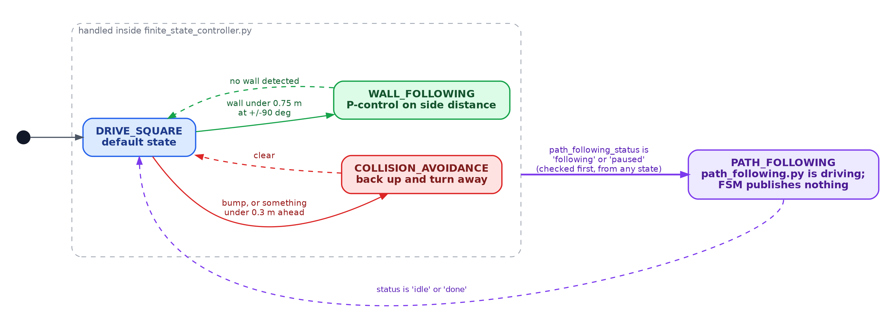

# RoboBehaviors and Finite State Machines Project

Aditi, Duc and Akil. Olin ENGR3590 Computational Introduction to Robotics.
Assignment: [RoboBehaviors and FSMs](https://comprobo26.github.io/assignments/warmup_project).

A ROS 2 Jazzy package (`ros_behaviors_fsm`) that drives a Neato in Gazebo with four behaviors and a finite state machine that combines them. **The full write-up, with design decisions, figures, limitations and how to run everything, is in [WRITEUP.md](WRITEUP.md).**



## Where things stand

| Behavior | File | Status |
|---|---|---|
| Drive a 1 m square | `drive_square.py` | Works in Gazebo: every leg within 0.02 m and every turn within about 1 degree (odometry feedback). |
| Collision avoidance | `collision_avoidance.py` | Logic fixed and checked on synthetic and recorded scans, but **confirmed live that it currently does not move the robot when run alone**: it publishes `cmd_vel_collision_avoidance`, not `cmd_vel`. Its recorded bag predates that rename and no longer matches the code. Details in the write-up. |
| Wall following | `wall_follower.py`, and the `WALL_FOLLOWING` state | Standalone node steers correctly on both sides (reported choppy in the sim), but has the same problem as collision avoidance: it now publishes `cmd_vel_wall_follower`, confirmed live to not move the robot alone. The FSM's `WALL_FOLLOWING` state had the same scan-indexing bug as collision avoidance, now fixed, but not yet run in Gazebo. No wall `Marker` yet. |
| Mapping, A* planning, path following (self-designed) | `teleop_scan.py`, `room_map.py`, `a_star.py`, `path_following.py` | Run in Gazebo and recorded in `bags/`. ICP localization (`icp_localizer.py`) is tested on synthetic data only. |
| State machine (`finite_state_controller.py`) | `finite_state_controller.py` | Its `COLLISION_AVOIDANCE` transition is **confirmed live in Gazebo**: placed facing an obstacle, it drove up and backed away turning, as designed. `WALL_FOLLOWING` and `PATH_FOLLOWING` are still only checked with synthetic inputs. |
| State machine (`fsm_node.py`, in progress) | `fsm_node.py`, `fsm.launch.py` | A second, different state-machine design, added mid-write-up by a teammate ("only halfway there" per their own commit). Its launch file still does not run (wrong package names, not installed). The topic-name mismatch that stopped it reacting to collision avoidance ("just rams into the object") is fixed and re-verified live; `"OBSTACLE AVOIDANCE"` firing end to end is still unconfirmed. Not reconciled with `finite_state_controller.py` yet. Details in the write-up. |

Nothing has been tested on the physical Neato.

## Quick start

```bash
cd ~/ros2_ws
colcon build --packages-select ros_behaviors_fsm
source install/setup.bash
ros2 launch neato2_gazebo neato_maze.py            # in its own terminal
ros2 run ros_behaviors_fsm drive_square            # one behavior at a time; each publishes cmd_vel
```

Other nodes: `finite_state_controller` (moves the robot directly), `teleop_scan`, `path_following`, `icp_localizer`. `collision_avoidance` and `wall_follower` currently do **not** move the robot when run by themselves -- see [Where things stand](#where-things-stand) and the write-up. Mapping and path-following steps, and how to record and play back bags, are in the write-up's [How To Run](WRITEUP.md#how-to-run).

## Layout

| Path | Contents |
|---|---|
| `ros_behaviors_fsm/` | The ROS nodes and their helpers |
| `bags/` | Recorded runs: `teleop_scan_demo`, `path_following_demo` |
| `docs/` | Diagram sources (`fsm.dot`, `pipeline.dot`, `fsm_node.dot`), `make_figures.py`, `plot_potential_field_fix.py`, and the figures used in the write-up |
| `WRITEUP.md` | The write-up |

## Still to do

See the checklist at the end of [WRITEUP.md](WRITEUP.md#status-delete-before-submitting). The main items right now: `collision_avoidance.py` and `wall_follower.py` still do not move the robot when run alone (they publish `cmd_vel_collision_avoidance`/`cmd_vel_wall_follower`, and the simulator only listens on `cmd_vel`) -- `fsm_node.py`'s side of this is fixed, but running either node by itself still does nothing; fix `fsm.launch.py` (wrong package names, not installed); decide how `fsm_node.py` and `finite_state_controller.py` relate; re-record the collision-avoidance and wall-following bags once that's settled; add the wall-detection `Marker`; tune the gains; run the FSM's `WALL_FOLLOWING`/`PATH_FOLLOWING` states and `drive_square` live; and physical-robot testing.
