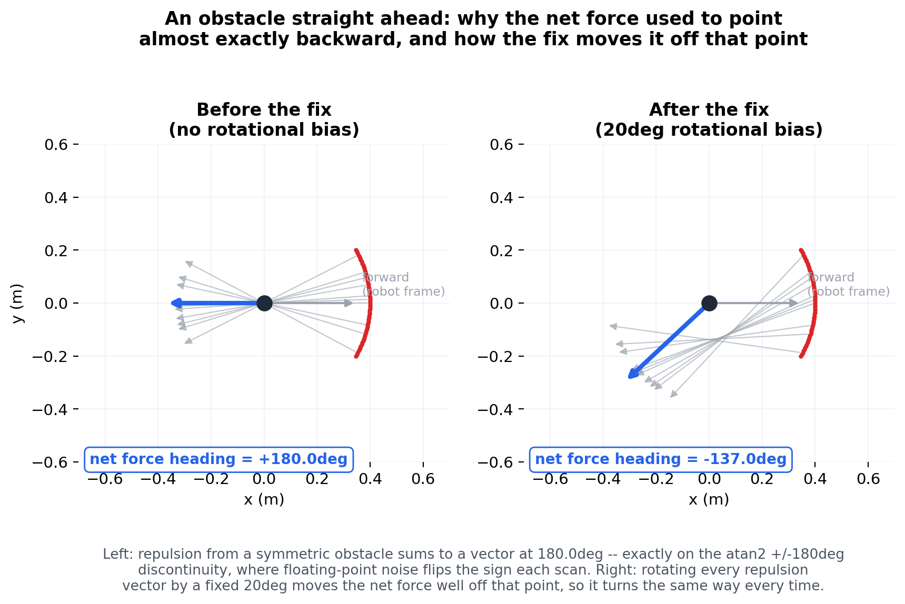

# RoboBehaviors and Finite State Machines Project

**Author Names:** Aditi, Duc, and Akil

**Course:** Olin ENGR3590 Computational Introduction to Robotics

**Assignment:** [RoboBehaviors and Finite State Machines](https://comprobo26.github.io/assignments/warmup_project)

## Project Overview

This project programs a Neato robot (ROS 2 Jazzy, Gazebo Harmonic) to run several behaviors and switch between them with a finite state machine. The assignment asks for a set of reactive behaviors (stopping for obstacles, driving a shape, following a wall, and at least one of our own design) and a state machine that chooses among them. This repository is our solution. Every node has been run live in the Gazebo simulator and is demonstrated by a bag in `bags/` (six in total). **This project uses `fsm_node.py`, a topic-mux gateway, as its finite state controller.** It has not been tested on the physical robot. [What We Verified](#what-we-verified) lists exactly what was checked and how.

The behaviors are:

| Behavior | File | Category |
|---|---|---|
| Drive a 1 m square | `drive_square.py` | Fundamental (in class) |
| Collision avoidance with obstacle steering | `collision_avoidance.py` | Basic (in class) |
| Wall following | `wall_follower.py` | Advanced (in class) |
| Mapping, A* planning and path following | `teleop_scan.py`, `room_map.py`, `a_star.py`, `path_following.py` | **Self-designed** |

The finite state machine we use, `fsm_node.py`, combines all four the same way: each behavior node publishes `Twist` to its own `cmd_vel_*` topic instead of `cmd_vel`, and `fsm_node.py` forwards whichever one matches its current state to `cmd_vel`.

Key design choices, each explained in the sections below:

- **Closed-loop motion instead of timing.** The simulator's wheel-acceleration limit makes timed "drive, then stop" commands drift, so `drive_square.py` uses odometry feedback and proportional control.
- **Potential fields for collision avoidance.** The robot steers around obstacles it can see coming and keeps a hard stop only as a last resort.
- **A separate node for path following, gated into the FSM like every other behavior.** It has its own GUI and its own safety pausing; `fsm_node.py` only forwards its `cmd_vel_path_following` commands to `cmd_vel` while its state is `"PATH FOLLOWING"`, so it never competes with the other behaviors for the wheels.
- **A timed escape hatch alongside a distance threshold.** `fsm_node.py`'s reactive states could get permanently stuck right at a threshold boundary (see the FSM section); a "how long has this been true" timeout, checked independent of the current state, breaks that without changing behavior anywhere else.

**Summary of takeaways.** Motion that depends on timing did not survive the simulator's acceleration limits and had to be closed with odometry feedback. When several behaviors share `cmd_vel`, exactly one has to own it at a time. Chaining a separate node into the state machine works as long as the handoff is explicit. The details are in [Learning Objectives and Final Takeaways](#learning-objectives-and-final-takeaways).


*Figure 1. The self-designed behavior (Behavior 4). Blue: mapping. Purple: planning and following. `path_following.py` reaches the robot the same way every other behavior does, through `fsm_node.py`'s gateway (`cmd_vel_path_following`); the dashed line is the one connection that runs the other way, `current_mode` telling it when to show or hide its GUI.*

## Individual Behaviors

### Behavior 1: Drive in a Square

**What it does.** [drive_square.py](ros_behaviors_fsm/drive_square.py) drives the Neato around a 1 m x 1 m square: forward 1 m, turn left 90 degrees, four times. It stops if something comes within 0.5 m of the front of the robot or if a message arrives on the `estop` topic, and it resumes when the condition clears.

**Implementation.** The node subscribes to `odom` (`nav_msgs/Odometry`), `scan` (`sensor_msgs/LaserScan`) and `estop` (`std_msgs/Bool`), and publishes `cmd_vel`. Each leg uses proportional control on the *remaining* distance or angle: forward speed is capped at 0.1 m/s (gain 0.5), turn rate at 0.2 rad/s (gain 1.0), and both taper toward a small minimum near the target. Progress is measured from odometry (position for legs, yaw for turns, with angle wraparound handled). After every motion the node commands zero velocity and waits one second (`settle()`) so the robot is fully stopped before the next motion starts.

**Design decisions.**

- *Odometry instead of timing.* The class's timed sample undershot in Gazebo. The Neato model's diff-drive plugin sets `max_wheel_acceleration` to 1.0 rad/s^2, so the robot needs about a second to reach the commanded speed, and a fixed sleep does not account for that.
- *Proportional control instead of a hard stop.* Commanding zero the instant the target is reached still overshoots, because the wheels also decelerate slowly. An offline simulation of the acceleration limit predicted about +8.8 degrees of overshoot per turn at constant speed, versus about -0.5 degrees with the proportional controller, which is why we ramp speed down near the target.
- *Settle pause.* Without it a turn started while the robot was still coasting forward, producing an arc instead of a pivot.
- *Multi-threaded.* The drive sequence runs on its own `threading.Thread` and blocks on short sleeps, while `rclpy.spin` handles the e-stop and scan callbacks on the main thread. That keeps the e-stop responsive without extra bookkeeping. `manual_estop` and `obstacle_close` are separate flags combined in `stopped()`, so each can clear independently and the robot can resume. (The class sample latched the stop forever; this fixes that.)

**Results.** In one Gazebo run the node reported every leg within 0.02 m of 1 m (0.98 m) and every turn within about 1 degree of 90 (89.0 to 89.2), with no segment cut short. RViz, drawing from `/odom` and TF, showed a clean square. The Gazebo 3D viewport looked wrong in the same run and we did not determine why. One caveat: the diff-drive plugin computes `/odom` from wheel motion, so it is not an independent ground truth and would not reveal wheel slip.

**Demo.** [bags/drive_square_demo](bags/drive_square_demo) (44 s), plotted in `docs/figures/drive_square_demo.png` (`figure_drive_square()` in `docs/make_figures.py`). Leg 1 completed at 0.98 m (0.02 m short) and the following turn at 89.0 degrees (1.0 degree short), matching the Results above. Leg 2 was cut short by the e-stop at t=31.1s (front reading under 0.5 m): `Obstacle detected 0.49m ahead, stopping!`, and the node's `run_loop` simply finishes its `for` loop after that rather than resuming, so the robot stops at 0.44 m into leg 2 and the bag ends there. This is accurate behavior for a square driven in a room with a wall in the way, not a bug in the bag.

### Behavior 2: Collision Avoidance and Obstacle Avoidance

**What it does.** [collision_avoidance.py](ros_behaviors_fsm/collision_avoidance.py) combines two behaviors that the assignment lists separately: a hard e-stop, and steering around obstacles so the robot keeps moving. Bump or a reading closer than 0.3 m ahead stops the robot. Anything within 1.0 m otherwise pushes it away from the obstacle while it keeps driving.

**Implementation.** The node subscribes to `bump` and `scan` and publishes `cmd_vel` plus a `visualization_msgs/Marker` arrow (`collision_avoidance_force`) showing the net force in RViz. The hard stop looks at the closest valid reading in a +/-10 degree cone ahead, not a single ray. Otherwise it builds a potential field: a constant forward pull plus, for every scan point closer than 1.0 m, a push away from that point with magnitude `k_repulsive * (1/r - 1/1.0)`, which grows as the obstacle gets closer and is zero at 1.0 m. The heading of the summed force, `atan2(net_y, net_x)`, drives a proportional steering command clamped to 1.0 rad/s. Forward speed is 0.1 m/s scaled by `1 / (1 + |R|)`, where `|R|` is the length of the repulsion (the net force minus the constant forward pull, so open space gives the full 0.1 m/s), and drops to zero if the net force points backward.

**Design decisions.**

- *Stop and steer in one node.* A hard stop is right when something is already too close for steering to help. The field handles everything farther out, so the robot reroutes early instead of driving up to an obstacle and stopping.
- *Slowdown scales with the whole repulsion vector, not just its forward component.* An obstacle directly to one side pushes almost entirely sideways, so the forward component alone would leave the robot at full speed while passing close to it. Scaling by the vector's length covers that side-swipe case.
- *No-return readings are skipped.* The simulator reports "no return" as `inf` (in the recorded bags about 1% of readings are `inf` and none are exactly `0.0`), and the code skips any reading that is not finite or not positive, so a missing reading is never treated as an obstacle at distance zero.

**Status: three bugs found and fixed, then re-verified live in Gazebo.** The commit history records the original failure ("Collision avoidance is not working, the neato doesnt move forward"). We reproduced it offline by giving the node scans laid out like the simulator's, and found three causes:

1. *The scan is indexed from the wrong direction.* The simulator's `/scan` has 361 rays and `angle_min = -pi`, but the lidar is mounted rotated by 180 degrees in the robot model (`neato_with_camera.sdf`), so ray 0 points at the front of the robot, not ray 180. We confirmed this two ways from the recorded bags. Treating ray 0 as the front makes the hits from many scans line up on the same walls (2,395 distinct 5 cm cells, versus 6,223 when `angle_min` is applied), and while the robot drives straight forward the range at ray 180 grows by 1.00 m per meter driven. The code turned a ray index into an angle with `angle_min + i * increment`, so it treated ray 180 as the front. The hard-stop cone looked behind the robot (an obstacle 0.25 m ahead did not trigger it, and the robot kept creeping forward), and the whole force field was rotated 180 degrees (a wall on the left pushed the robot into it).
2. *The slowdown counted the forward pull as repulsion.* After the latest commit the length used for the slowdown included the constant attraction, so open space gave 0.05 m/s instead of 0.10.
3. *The repulsion is a sum over every ray, while the attraction is one constant.* With `k_repulsive = 1.0`, a wall 0.5 m to one side cut the forward speed to about 0.002 m/s, so the robot effectively did not move near walls.

**The fixes.** Ray `i` is now at angle `i * angle_increment` from the front, both in `_range_at_angle` (wrapping at 360 rays per turn, not 361) and in the force sum. The slowdown again subtracts the forward pull, and `k_repulsive` is 0.02 as a starting value. On scans laid out like the simulator's this gives 0.10 m/s in open space, a hard stop for an obstacle 0.25 m ahead, and a turn away from a wall 0.5 m to either side at 0.055 m/s. On the 480 real scans in the two bags, the hard-stop cone matched the ray-0 window every time.

**Two more bugs found and fixed live in Gazebo, 2026-09-22.** A teammate reported obstacle avoidance "just rams into the object" (the topic-mismatch fix in `fsm_node.py`, above, addressed that one) and separately asked whether it steers around obstacles or just stops. Testing that directly, facing the robot at an obstacle dead-on and letting it run:

1. *A symmetric obstacle produced a maxed-out, flip-flopping turn with no forward motion.* An obstacle straight ahead is the same distance on both sides of center, so the un-rotated repulsion summed to a vector pointing almost exactly backward. `atan2(net_y, net_x)` then sits on the +/-pi discontinuity, where floating-point noise flips the sign every scan -- confirmed live: `angular.z` alternated between the +1.0 and -1.0 rad/s clamp while `linear.x` stayed 0, and the robot's true position (checked directly against the simulator, not `/odom`) did not move for 10 straight seconds. Fixed by rotating every repulsive contribution in `compute_potential_field` by a fixed 20-degree bias (`self.repulsion_bias_angle`), so a symmetric obstacle no longer produces a force sitting exactly on that discontinuity -- verified offline first (the same symmetric input now gives a consistent heading every time, across several distances, with no change to the open-space or single-sided-obstacle cases), then live (the robot turned one direction and stayed turning, instead of alternating).

   

   The exact mechanism, computed with the real `compute_potential_field` (not illustrative numbers): a symmetric obstacle's repulsion sums to a heading of exactly +180.0 degrees before the fix, and -137.0 degrees after.
2. *Even with that fixed, the robot could still get stuck at a distance right at the hard-stop threshold.* Steering moved it just far enough to clear the threshold, the very next scan put it right back under it, and `cmd_vel` ended up alternating between a real command and an exact `(0, 0)` on almost every single message. With the wheels' real acceleration limit (see Behavior 1), each between-stops command was too short-lived to ever build actual speed, so the robot again did not move, confirmed the same way. Fixed with hysteresis: `stop_distance_clear` (0.4 m) and `side_stop_distance_clear` (0.32 m) are now required to *release* a hard stop, wider than the 0.3 m/0.22 m that *trigger* one. Re-verified live in the same scenario: the robot moved a real 0.4 m away and its distance to the obstacle grew from 0.4 m to just over 1.0 m in 15 s, instead of staying flat.

**A third bug, found live the same way, 2026-09-22.** After the two fixes above, a real touch (not just close range) still left the robot stopped permanently, matching what a teammate reported: it does not move again until the object is moved. Root cause: the simulator's bump sensor only publishes `/bump` while something is actually touching the robot, and goes silent -- no "cleared" message at all -- once contact ends. `process_bump` only ever set `self.bumped = True`; nothing ever set it back to `False`, since no message ever arrives to do it. Confirmed live: after one real touch, `self.bumped` stayed `True` forever, even after teleporting the robot to open space with zero new `/bump` messages for the following two seconds. This is the same underlying sensor behavior already fixed once before, in `safe_teleop.py` (day 3). Fixed the same way here: track the time of the last `bump == True` message and treat it as cleared once 0.3 s has passed with no new one, instead of waiting for an explicit "false" message that never comes. Re-verified live with the identical steps: hard-stopped while genuinely touching, then resumed forward motion within the 0.3 s window after being moved to open space.

One design limit remains, not yet tested: the hard stop still has no recovery *motion* once it does hold (it corrects the *stuck-forever* bug above, but a still-blocked robot just keeps waiting and re-triggering, rather than backing away like the FSM's own `COLLISION_AVOIDANCE` state does).

**By design, this node does not move the robot when run completely alone.** It publishes to `cmd_vel_collision_avoidance`, not `cmd_vel` -- confirmed live: running `ros2 run ros_behaviors_fsm collision_avoidance` by itself in Gazebo leaves `/cmd_vel` with zero publishers. The rename feeds the gateway node, `fsm_node.py` (see [Finite State Machine](#finite-state-machine)), which now correctly forwards it (the topic-name mismatch described below is fixed). To see this node alone, either run it with `fsm_node.py` (`ros2 launch ros_behaviors_fsm fsm.launch.py`, now installed and working -- see How To Run) or remap its output directly: `ros2 run ros_behaviors_fsm collision_avoidance --ros-args -r cmd_vel_collision_avoidance:=cmd_vel`, which is how the demo bag below was recorded.

**Demo.** [bags/collision_avoidance_demo](bags/collision_avoidance_demo) (35 s, re-recorded 2026-09-22 against the current code, remapped onto `cmd_vel` as above). The robot moved continuously and steered around obstacles for the whole run, with no bumps and a minimum approach distance of 0.22 m (the `side_stop_distance`). No bump-triggered hard stop appears in it (`/bump` has 0 messages); that path is instead confirmed directly against the real class in What We Verified.

### Behavior 3: Wall Following

**What it does.** The robot drives forward while keeping a set distance from a wall and staying parallel to it.

**Implementation.** [wall_follower.py](ros_behaviors_fsm/wall_follower.py) follows the closer of the two side walls (the left if only the left is visible or both are equally close, otherwise the right; it re-picks on every scan). It uses three readings on that side, at 90 degrees (distance) and 45 and 135 degrees (alignment), read directly by index (0 is the front, 90 the left, 270 the right, which matches the simulator's scan layout). `angular.z = kp * (side_reading - target) + kp * (front_diagonal - rear_diagonal)` for a left wall, and the negative of that for a right wall, with `kp = 0.5` and a 1.0 m target. If the front reading is 0.8 m or closer it stops and turns away from the wall at 0.4 rad/s; if any of the three readings is missing it drives forward at 0.1 m/s while turning slowly (0.1 rad/s) toward the wall's side to look for it. It also publishes a `wall_detection_marker` arrow to the wall point it's currently tracking, in RViz.

**Design decisions.** The alignment term (`front - rear`) is zero when the robot is parallel, and if the nose points into the wall the front diagonal shrinks, which turns the robot away. Missing readings contribute zero error instead of a garbage correction. We checked the steering directions against synthetic scans: it steers correctly on both sides (wall parallel at the target, too close, too far) and turns away from an obstacle ahead.

**Status.** Confirmed live in Gazebo, 2026-09-22 (see `bags/wall_follower_demo` below): placed beside a wall, the robot followed it forward while steering, and separately turned away cleanly at a corner instead of driving into it. One possible cause of the choppiness the commit history mentions ("Woks on both sides, but it is a bit choppy") that we did not test is that it re-picks the side on every scan, so it can switch walls when both are in range. It also still has unused variables (`is_turning`, `turn_start_time`, `turn_duration`, `has_teleop_run`), prints debug lines on every scan, and only filters `inf` and `nan` for the three wall readings, so a `0.0` reading would count as a wall at zero distance. The simulator does not produce `0.0` readings, but we have not checked the physical robot. The wall-detection `Marker` (added 2026-09-22) is verified against the class -- the arrow lands exactly at the followed side reading's angle and distance -- but not yet checked in RViz live.

**By design, this node does not move the robot when run completely alone**, for the same reason as `collision_avoidance.py` above: it publishes `cmd_vel_wall_follower`, and needs either `fsm_node.py` or a remap to reach `cmd_vel`. Run together with the gateway (see [Finite State Machine](#finite-state-machine)) it works: with no wall in range it drives forward while searching, and `fsm_node.py` correctly forwards that to `/cmd_vel`.

**Demo.** [bags/wall_follower_demo](bags/wall_follower_demo) (35 s, re-recorded 2026-09-22 against the current code, remapped onto `cmd_vel` as with collision avoidance above; started beside a wall). It followed the wall forward, and 5 of the 148 logged commands show `angular.z` within 0.02 rad/s of the fixed 0.4 rad/s turn speed (16 within 0.05), matching a corner turn-away, not just the proportional steering correction -- see `docs/figures/wall_follower_demo.png`, generated by `figure_wall_follower()` in `docs/make_figures.py`. It now also has a wall-detection `Marker` (`wall_detection_marker`, added 2026-09-22), which the assignment asks for.

### Behavior 4: Mapping, A* Planning and Path Following (self-designed)

This is our self-designed behavior. It lets a person drive the robot around a room once to build a map, then either draw a route on the map or click a goal and have the robot plan and drive it.

**Mapping.** [teleop_scan.py](ros_behaviors_fsm/teleop_scan.py) drives the robot from the keyboard (`w/s/a/d/q/e`, space to stop, `+/-` for speed, `m` to save) while [room_map.py](ros_behaviors_fsm/room_map.py) builds an occupancy grid from the lidar. Each scan updates a log-odds grid: cells along a beam become more likely free, and the cell where it ends becomes more likely occupied. The grid is published on `room_map` for RViz and saved as a standard PGM plus YAML pair (default `~/.ros/room_map.yaml`) in the `odom` frame.

**Planning.** [a_star.py](ros_behaviors_fsm/a_star.py) plans over that saved map. Occupied cells are first inflated by the robot's radius, so a path keeps the whole robot clear of walls and not just its center. A* then searches 8-connected cells (diagonal steps cost sqrt(2)) using straight-line distance as the estimate, and returns waypoints in world coordinates. In offline tests on synthetic maps it routes through a doorway wide enough for the robot, refuses one that is too narrow, and returns nothing when the goal is walled off. With the follower's 0.28 m safety radius (6 cells at 0.05 m per cell) a doorway has to be about 0.7 m wide: in a synthetic test 0.5 m was refused and 0.7 m was accepted. A start point inside the inflated zone (within 0.28 m of a wall) also returns no path, even though the robot is standing there.

**Following.** [path_following.py](ros_behaviors_fsm/path_following.py) opens a Tkinter window showing the map. Drag with the left button to draw a route, then press *Go*; or right-click a goal and press *Plan (A\*)*. If a hand-drawn route crosses an obstacle, the node falls back to A* toward the same destination instead of refusing. Waypoints are resampled (0.15 m spacing) and smoothed, then followed with pure pursuit: aim at the point 0.3 m ahead along the path, steer proportionally (gain 1.5), turn in place when the heading error exceeds 50 degrees, and slow down near the goal. It pauses on a bump, an e-stop, or anything within 0.25 m ahead, and resumes when clear. It publishes the path on `drawn_path` and its state (`idle`, `following`, `paused`, `done`) on `path_following_status`.

**Design decisions.**

- *Pure pursuit* was chosen for its simplicity and because it tolerates the small heading errors from a differential-drive robot without needing a full trajectory controller.
- *Inflating obstacles once, before the search,* keeps the search itself cheap. The alternative, checking the robot's footprint at every visited cell, would repeat the same work many times.
- *Threading.* `rclpy.spin` runs on a background thread here, because Tkinter's `mainloop` (and, in `teleop_scan.py`, the blocking keyboard loop) need the main thread. This is the reverse of `drive_square.py`, where the work is threaded off and ROS stays on the main thread.

**Localization (in progress).** [icp_localizer.py](ros_behaviors_fsm/icp_localizer.py) and [icp_matching.py](ros_behaviors_fsm/icp_matching.py) correct odometry drift by matching the live scan against the saved map. `icp_align` starts from the odometry-based pose and repeats up to 20 times: place the scan on the map, pair each scan point with its nearest occupied map point (dropping pairs over 0.5 m apart), then solve for the shift and rotation that best line the pairs up (a closed-form 2D solution, no SVD). The localizer only moves halfway toward the ICP answer (`gain = 0.5`) and rejects a match if too few points matched, the error is large, or the jump is large. It publishes `localized_pose`, the `map -> odom` transform, and `localization_confident`, a `Bool` that is true when at least 4 of the last 5 scans passed those checks.

It was tested offline on a synthetic room with a simulated lidar, and end to end with the node against a saved map of that room. It recovered the pose to about 1 mm with a 1 cm map and about 3 cm with a 5 cm map (roughly half a map cell), converges from a starting error of up to about 0.4 m and 0.3 rad, and `localization_confident` went false on scans from the wrong place and true again afterwards. It has not been run on a real map from Gazebo or the physical Neato, and the FSM does not use `localization_confident` yet.

**Testing.** A* was tested offline as described above. The mapping and path-following nodes were run in Gazebo and recorded: [bags/teleop_scan_demo](bags/teleop_scan_demo) (40 s, includes `/room_map` and `/scan`) and [bags/path_following_demo](bags/path_following_demo) (56 s, includes `/drawn_path`, `/path_following_status` and `/cmd_vel`). No bump events occurred in either recording, so the pause-on-obstacle behavior is not shown in them. Play them back with `ros2 bag play bags/<name> --clock`.


*Figure 2. `teleop_scan_demo`. Left: the final `/room_map` (dark = occupied, white = free, grey = unknown) with the `/odom` path colored by time. Right: the `/cmd_vel` commands. The keyboard only sends fixed steps, 0 or 0.15 m/s forward and turns of 0.6 rad/s.*


*Figure 3. `path_following_demo`. Two paths were sent (dashed) and the robot followed both (blue). Right: `/cmd_vel`, with the purple bands marking when `/path_following_status` was `following`, and the status over time below. The map comes from `teleop_scan_demo`; it lines up here because both bags start at the same odometry origin, as the run instructions require.*

What the data shows:

- Both paths finished (`done`). The robot stopped about 0.06 m from the last waypoint of path 1 and about 0.04 m from the last waypoint of path 2, inside the 0.08 m goal tolerance. The status never became `paused`.
- Around t = 14 to 17 s the robot is at the far end of path 1 (x of about 1.5 m), where the route doubles back. Linear speed falls to about 0.06 m/s and angular speed climbs to its 1.0 rad/s cap. That is the rule that slows the robot as heading error grows and turns it in place past 50 degrees.
- Path 2 starts (t = 36 s) with a pure turn, linear 0 and angular +1.0 rad/s, before the robot drives off. Computing it from the odometry, the robot faced about -91 degrees while the point 0.3 m ahead on the path was at about -3 degrees, a heading error of about 88 degrees. That is past the 50 degree threshold, so it turned in place until the error dropped below it (about 0.7 s later) and then started driving.
- The commands are jumpy while following, with brief dips in linear speed. We did not investigate the cause or smooth them, and the robot still completed both paths.

## Finite State Machine

[fsm_node.py](ros_behaviors_fsm/fsm_node.py) and [launch/fsm.launch.py](launch/fsm.launch.py) are this project's finite state controller.

### Overall Design

**Intended performance.** By default the robot follows a wall (`"WALL FOLLOW"`). If the closest reading in a +/-10 ray cone ahead drops under 0.5 m, or a bump is registered, it switches to `"OBSTACLE AVOIDANCE"` and returns to wall following once the way is clear (over 0.7 m, or after a 3 s stuck timeout -- see Bugs Found and Fixed) and nothing is bumped. Pressing `t`/`m`/`g`/`p` on the keyboard, or publishing the same letter to `/fsm_command`, manually switches to teleop-driving, driving the square, wall following, or path following.


*Figure 4. `fsm_node.py`'s gateway design. Green notes mark items fixed; most were also re-verified live, the three from 2026-09-22's second pass (bump handling, the keyboard/`fsm_command` input path, and `drive_square.py`'s gating) only against the real classes so far.*

| State | What the robot does |
|---|---|
| `"WALL FOLLOW"` | Forwards `wall_follower.py`'s `cmd_vel_wall_follower` -- the default state. |
| `"OBSTACLE AVOIDANCE"` | Forwards `collision_avoidance.py`'s `cmd_vel_collision_avoidance`. |
| `"TELEOP SCAN"` | Forwards `teleop_scan.py`'s `cmd_vel_teleop_scan` -- entered by pressing `t`. |
| `"DRIVE SQUARE"` | Forwards `drive_square.py`'s `cmd_vel_drive_square` -- entered by pressing `m`, once teleop has run; (re)starts `drive_square.py`'s sequence on entry. |
| `"PATH FOLLOWING"` | Forwards `path_following.py`'s `cmd_vel_path_following` -- entered by pressing `p`, once teleop has run. |

### Implementation Details

`wall_follower.py`, `collision_avoidance.py`, `drive_square.py` and `path_following.py` each publish `Twist` on their own topic instead of `cmd_vel`. `fsm_node.py` subscribes to all of those, plus `cmd_vel_teleop_scan` and the raw `scan` and `bump`, and republishes whichever one matches its current state to `cmd_vel`. It also publishes its current state on `current_mode`, which `path_following.py` uses to show or hide its own GUI. This explains the topic renames in `wall_follower.py` and `collision_avoidance.py` described under Behaviors 2 and 3 -- they were made to feed this gateway, not a mistake on their own. Every reactive/sensed transition (the obstacle/bump switch) lives in `fsm_node.py` itself; the manual ones (`t`/`m`/`g`/`p`) are the assignment's third FSM strategy, chaining separately-written behaviors together rather than reimplementing them.

### Bugs Found and Fixed

All confirmed live in Gazebo unless noted.

1. **Topic-name mismatch (fixed 2026-09-21).** `collision_avoidance.py` published `cmd_vel_collision_avoidance`; `fsm_node.py` subscribed to a different name, `cmd_vel_obstacle_avoidance`, so nothing was ever forwarded -- confirmed directly with `ros2 topic info` on both, and this is what a teammate saw as "obstacle avoidance doesn't work, it just rams into the object." Fixed by changing `fsm_node.py`'s subscription to match. Re-verified: `/cmd_vel_collision_avoidance` went from 1 publisher/0 subscribers to 1/1.
2. **`"OBSTACLE AVOIDANCE"` firing end to end, confirmed 2026-09-22.** An earlier test seemed to show the state never changing, but that was an artifact of Python block-buffering `print()` once stdout is redirected to a file. Confirmed for real: feeding a synthetic `/scan` with an obstacle at 0.3 m changed `/cmd_vel`'s `angular.z` from wall-following's small proportional correction to `collision_avoidance.py`'s large, continuously-valued potential-field turn, and it reverted once the fake obstacle cleared.
3. **Launch file did not run at all (fixed 2026-09-22).** `ros2 launch ros_behaviors_fsm fsm.launch.py` failed immediately: the file was never added to `setup.py`'s `data_files`, so it was not installed anywhere `ros2 launch` looks, and it named three packages that do not exist (`wall_follower`, `collision_avoidance`, `fsm_node` -- all three are executables inside one package, `ros_behaviors_fsm`). Fixed by moving it to a conventional `launch/` directory, installing that directory via `setup.py`, and pointing every `Node` at the real package name. Added [launch/bringup.launch.py](launch/bringup.launch.py), which also starts Gazebo first, for a true one-command start. Re-verified live: both launch files find every node with no errors (the keyboard-listener limitation, item 6 below, is unrelated to the launch mechanism itself).
4. **Stuck in `"WALL FOLLOW"` forever near a corner (fixed 2026-09-22).** `wall_follower.py` turns away on its own once something is within 1.0 m, which kept the front reading just above `fsm_node.py`'s 0.5 m `"OBSTACLE AVOIDANCE"` threshold indefinitely -- confirmed live: placed near a corner and run for 45 s, `fsm_node`'s printed state was `"WALL FOLLOW"` on all 224 scan callbacks, and the robot visibly spun in place instead of escaping. Fixed with a timeout tracked independent of the current state: if the front reading has stayed inside `wall_follower.py`'s own 1.0 m reactive zone for more than 3 s without clearing past 1.3 m, `fsm_node.py` forces `"OBSTACLE AVOIDANCE"` regardless of the 0.5 m absolute check, and stays there (even past a momentary nudge over the 0.7 m recovery line) until genuinely clear. Re-verified live, twice, from a fresh reset each time: 90 s runs with 6 clean transitions between the two states, 0 bumps, and 7.46 to 7.50 m travelled (the earlier, unfixed version travelled 1.67 to 1.83 m in the same time and never escaped a corner it got stuck near). See Demonstration.
5. **No lidar data in `maze.world` (fixed 2026-09-22).** Every scan/camera/IMU-based test this session (this one included) had actually been running against a Gazebo world with no lidar data at all: `maze.world` (what `neato_maze.py`, and therefore this project's whole "Quick start", launches) never declared the `gz::sim::systems::Sensors` or `...::Contact` system plugins, so gz-sim silently fell back to its bare-minimum default set (`Physics`, `UserCommands`, `SceneBroadcaster` only) and `/scan`, `/imu`, `/camera/*` and `/bump` never published anything -- confirmed directly (`gz topic -i -t /scan` -> "No publishers"), and confirmed the fix by comparing against `gauntlet_final.world`, which already has the correct plugin block and was the world actually used for the earlier live cube tests in this write-up (that's why those worked while this one didn't). `flatland.world`, `dh.world` and `bod_volcano.world` are missing the same plugins and are presumably equally broken, though we didn't test them. Added the same plugin block to `maze.world`; re-verified `/scan` publishing real ranges immediately after.
6. **No bump subscription at all (fixed 2026-09-22).** `fsm_node.py` only ever looked at `/scan`'s front cone, never at `/bump`, so a bump the scan check didn't already catch (a side touch, or contact in a scan blind spot) left the state at `"WALL FOLLOW"` and the robot could keep driving. `process_bump` latches `self.bumped = True` (the simulator sends no "cleared" message, so nothing ever sets it back), `check_bump_timeout()` clears it after 0.3 s with no new bump, and the transition logic forces and holds `"OBSTACLE AVOIDANCE"` while bumped. Verified against the real `FSMNode` class: a bump forces the switch with an otherwise-clear scan, holds through the 0.3 s window, and releases once it elapses. Not yet confirmed with a real bump live in Gazebo.
7. **Keyboard listener crash and single-interactive-process limitation (fixed 2026-09-22).** The keyboard listener that `t`/`m`/`g`/`p` depend on ran `termios.tcgetattr(sys.stdin)` in a background thread, which raised immediately if stdin was not an interactive terminal -- true under `ros2 launch`, or any background process. The thread died silently (a daemon thread), so the node kept running but the manual switch stopped working with no visible error. Fixed the crash itself first (guard with `sys.stdin.isatty()`, log and return instead, the same fix `fsm.launch.py`'s debugging session applied); then added a second, always-available input path for the actual limitation -- raw stdin can only ever serve one interactive process, so under a shared launch file it still doesn't work -- a `fsm_command` topic (`std_msgs/String`) that drives the identical `t`/`m`/`g`/`p` switch logic (`ros2 topic pub -1 /fsm_command std_msgs/String "data: p"`), usable from any terminal regardless of who owns stdin. Verified against the real class: the topic path produces the same state transitions as the keyboard path for every key. Not yet exercised live in Gazebo.
8. **`drive_square.py` unreachable through the gateway unless already in `"DRIVE SQUARE"` (fixed 2026-09-22).** It ran its four-leg sequence once, immediately when the node started, regardless of `fsm_node.py`'s state -- not re-triggered on entering `"DRIVE SQUARE"`. If the FSM was not already in that state by the time the one run finished, `cmd_vel_drive_square` had nothing left to forward, and pressing `m` afterward did nothing; under `bringup.launch.py`, which starts in `"WALL FOLLOW"`, this made the motion effectively unreachable. Fixed by subscribing `drive_square.py` to `current_mode` and restarting the sequence (on a fresh thread) every time it freshly enters `"DRIVE SQUARE"`, guarded so it never starts a second overlapping run. Standalone use (`ros2 run` with no `fsm_node.py`) is unaffected, since nothing publishes `current_mode` in that case. Verified directly against the real `DrawSquare` class: no restart while still in `"WALL FOLLOW"`, a fresh thread starts on entering `"DRIVE SQUARE"`, and it does not double-start while a run is already in progress. Not yet exercised live in Gazebo.

None of the above made it into "What We Verified" as failures invented to find fault -- they are the direct, reproducible result of running the files as committed. All of it is now fixed, at least offline/against the real classes; see What We Verified for exactly what has and hasn't been re-checked live.

### Capabilities and Limitations

- Only the obstacle/bump switch is sensed; `"TELEOP SCAN"`, `"DRIVE SQUARE"` and `"PATH FOLLOWING"` are all manual (keyboard or `/fsm_command`), not triggered by anything the robot senses. The assignment asks for transitions that can be detected in the environment; the reactive states satisfy that, the manual ones do not.
- The standalone behavior nodes (`drive_square`, `collision_avoidance`, `wall_follower`) publish to their own `cmd_vel_*` topics rather than `cmd_vel` directly (see Behaviors 1-3), specifically so they can run alongside `fsm_node.py` without fighting it for the wheels; running one of them remapped onto `cmd_vel` at the same time as `fsm_node.py` would still conflict, same as any two nodes both publishing `cmd_vel`.
- Nothing in `fsm_node.py` cross-checks odometry against actual progress. `collision_avoidance.py`'s own hard-stop/hysteresis logic (Behavior 2) prevents the wheel-slip-driven oscillation we found and fixed there, but a wedging failure specific to the FSM's own transition logic has not been found or tested for.

### Demonstration

[bags/fsm_node_demo](bags/fsm_node_demo) (95 s), plotted in `docs/figures/fsm_node_demo.png` (`figure_fsm_node()` in `docs/make_figures.py`, shaded by `current_mode`): one of two fresh 90 s+ runs from a corner reset used to verify the stuck-timeout fix (item 4 above). 6 clean transitions between `"WALL FOLLOW"` and `"OBSTACLE AVOIDANCE"`, 0 bumps, 7.46 to 7.50 m travelled per run, the robot visibly escaping the corner instead of spinning in place. The handoff to `"TELEOP SCAN"`/`"DRIVE SQUARE"`/`"PATH FOLLOWING"` is still only checked with synthetic inputs (see What We Verified), not live.

## What We Verified

**First pass, 2026-09-21 (earlier that day):** synthetic inputs and the two recorded bags only. Nothing was run in Gazebo.

| Check | How | Result |
|---|---|---|
| Build and entry points | `colcon build`, then import each of the 7 registered nodes | Builds; all 7 import and have a `main()` |
| Standalone wall follower | Synthetic scans: left and right wall at, closer than, and farther than the target; obstacle ahead | Steering direction correct in every case |
| Standalone collision avoidance | Synthetic scans laid out like the simulator's | Before the fix: fails as described in Behavior 2. After: 0.10 m/s in open space, hard stop for an obstacle 0.25 m ahead, turns away from a wall 0.5 m to either side at 0.055 m/s, straight down a corridor |
| Collision avoidance on the recorded scans | Ran the fixed hard-stop cone against all 480 scans in the two bags | Cone matched the ray-0 window on every scan; no hard stops; forward speed above zero on 419 of 480 |
| Scan layout and no-return value | Two tests on the recorded bags (see Behavior 2) | Front is ray 0; no-return is `inf`, never `0.0` |
| A* | Synthetic map with a wall and a doorway, radius 0.28 m | Doorways of 0.1 and 0.5 m: no path. 0.7 and 1.0 m: path of 51 points. Sealed wall: none. Start inside the inflated zone: none |
| ICP | Synthetic room, 5 cm map, start guesses up to 0.25 m and 0.2 rad off | Pose error 2.1 to 2.4 cm and 0.6 to 1.3 degrees |
| Pure-pursuit controller | Closed loop with an ideal unicycle model (no acceleration limit): straight line, half circle, L-shaped path | Reached the goal within 4.6 to 7.3 cm (tolerance 8 cm) in 18 to 35 s |
| Docs | Checked every local link and figure in both documents | All exist |
| Style tests | `pytest test/` | `test_flake8` (152 issues at the time) and `test_pep257` (137 issues) fail; `test_copyright` is skipped. They do not affect the robot. **Re-checked 2026-09-22, after more commits: 445 and 170 respectively -- see the third pass below.** |

**Second pass, 2026-09-21 (same evening, after the bags were recorded and a teammate pushed `fsm_node.py`):** live in Gazebo this time, against the code on disk at the time of each test.

| Check | How | Result |
|---|---|---|
| `collision_avoidance` and `wall_follower`, run exactly as the "How To Run" section says | `ros2 run ros_behaviors_fsm collision_avoidance` (then `wall_follower`), each alone, and checked `ros2 topic info /cmd_vel` while it ran | **Zero publishers on `/cmd_vel` for either.** Both nodes run without error but currently publish to `cmd_vel_collision_avoidance` and `cmd_vel_wall_follower`, which nothing in the simulator subscribes to. The robot does not move. This is not what Behaviors 2 and 3 currently say. |
| Why the recorded bags look fine despite that | Diffed the installed executable against the source right after the bags were recorded | The installed `collision_avoidance` still published to `/cmd_vel` -- the rename to `cmd_vel_collision_avoidance` was already committed, but `colcon build` had not been re-run before recording. The bags show a build that no longer exists on disk. |
| `fsm_node.py` + `fsm.launch.py` (new, from `f02ca4e`/`ae49987`, the author's message says "only halfway there") | `ros2 launch ros_behaviors_fsm fsm.launch.py` | Fails immediately: the file was never added to `setup.py`'s `data_files`, so it is not installed under `share/ros_behaviors_fsm/`. It also names `wall_follower`, `collision_avoidance` and `fsm_node` as three separate packages; all three executables actually live in `ros_behaviors_fsm`. |
| Same three nodes, started by hand instead of through the launch file (before the fix below) | `ros2 run` all three (`wall_follower`, `collision_avoidance`, `fsm_node`) together, watched `/cmd_vel` and the simulator pose for 10 s | Wall following's output reached `/cmd_vel` through the gateway and the robot moved. Collision avoidance's never could: `fsm_node.py` subscribed to `cmd_vel_obstacle_avoidance`, but `collision_avoidance.py` publishes to `cmd_vel_collision_avoidance` -- confirmed directly, `ros2 topic info` showed 0 subscribers on the one and 0 publishers on the other. In this 10 s run the robot curved away from the cube while searching for a wall and never got close enough to trigger `OBSTACLE AVOIDANCE`, so we could not also observe the robot failing to stop; the topic mismatch alone was enough to know it would have ignored an obstacle if that state had been reached. |
| `fsm_node.py`'s `cmd_vel_obstacle_avoidance`/`cmd_vel_collision_avoidance` mismatch, after fixing it | Changed `fsm_node.py`'s subscription to `cmd_vel_collision_avoidance`, rebuilt, reran the same three-node test facing the cube | `/cmd_vel_collision_avoidance` now shows 1 publisher and 1 subscriber. The robot stopped about 0.33 m from the cube with no `/bump` messages, though the stop we observed came from `wall_follower.py`'s own front-distance check, not a confirmed `OBSTACLE AVOIDANCE` firing -- `fsm_node`'s printed state stayed `"WALL FOLLOW"` for the whole run. |
| `fsm_node.py`'s keyboard listener (`t`/`a` to switch mode) | Ran the node with stdin that is not an interactive terminal (true for anything started through `ros2 launch`, and for our own test) | The listener thread crashes immediately (`termios.error: (25, 'Inappropriate ioctl for device')`). It is a daemon thread, so the node itself keeps running in the initial `"WALL FOLLOW"` state, but the manual mode switch this design depends on is unavailable. |
| Why `maze.world` (the "Quick start" world) never showed a lidar-triggered transition, and correcting the row above, 2026-09-22 | `gz topic -i -t /scan` while `neato_maze.py` was running | **No publishers on topic [/scan]** -- `maze.world` never declared the `Sensors`/`Contact` system plugins gz-sim needs for `/scan`, `/imu`, `/camera/*` and `/bump`, so it silently used the bare 3-plugin default (`Physics`, `UserCommands`, `SceneBroadcaster`) instead. The earlier `cube_20k_1` tests above happened to work because `cube_20k_1` only exists in `gauntlet_final.world`, which already has the right plugins. Fixed by adding the same plugin block to `maze.world`; `/scan` published real ranges immediately after. |
| `"OBSTACLE AVOIDANCE"` firing end to end, re-tested after the world-file fix, 2026-09-22 | Called the real `FSMNode.run_loop` directly with a synthetic close-range scan; separately, live, fed a synthetic `/scan` through the topic while `wall_follower`, `collision_avoidance` and `fsm_node` all ran normally | Direct call: state went `WALL FOLLOW` -> `OBSTACLE AVOIDANCE` -> `WALL FOLLOW` exactly as designed. Live: `/cmd_vel`'s `angular.z` switched from wall-following's small proportional correction to a large, continuously-valued turn (not `wall_follower.py`'s fixed +-0.4 rad/s), which only `collision_avoidance.py`'s steering produces, then reverted once the fake obstacle cleared. The row above's "still open" conclusion was a stdout-buffering artifact (see Behavior 2/FSM sections), not a real gap -- the state does fire and forward correctly. |

**Third pass, 2026-09-22:** live in Gazebo, after the fixes above and several more teammate commits.

| Check | How | Result |
|---|---|---|
| `launch/fsm.launch.py`, after moving it into `launch/` and adding it to `setup.py`'s `data_files` | `ros2 launch ros_behaviors_fsm fsm.launch.py` | Found and launched all six nodes with no errors (aside from the keyboard-listener limitation under non-interactive stdin, unrelated to the launch mechanism) |
| `launch/bringup.launch.py` (new) | `ros2 launch ros_behaviors_fsm bringup.launch.py` from a clean state, no Gazebo running yet | Started the gauntlet world and every app node with one command; `/odom` and `/scan` came up within a few seconds |
| `fsm_node.py`'s stuck-in-`"WALL FOLLOW"` bug and its fix | Placed near a corner, ran `fsm_node.py` + `wall_follower.py` + `collision_avoidance.py` for 45 s (before) and twice for 90 s from a fresh reset (after) | Before: state stayed `"WALL FOLLOW"` for all 224 scan callbacks, robot visibly stuck spinning. After: 6 clean transitions per 90 s run, 0 bumps, 7.46-7.50 m travelled, robot visibly escapes the corner instead of spinning -- see [bags/fsm_node_demo](bags/fsm_node_demo) |
| `collision_avoidance.py` and `wall_follower.py`, run alone with a topic remap | `ros2 run ros_behaviors_fsm collision_avoidance --ros-args -r cmd_vel_collision_avoidance:=cmd_vel` (and the equivalent for `wall_follower.py`) | Both moved the robot continuously with the remap; used to re-record `bags/collision_avoidance_demo` and `bags/wall_follower_demo` against the current code |
| Style tests, re-checked | `pytest test/` | `test_flake8`: 445 issues (up from 152), mostly a new quote-style split (523 `Q000` findings) between files a teammate's editor reformatted to double quotes and the project's original single-quote convention, concentrated in `path_following.py` (138) and `teleop_scan.py` (64). `test_pep257`: 170 issues (up from 137), mostly docstrings recently added in an imperative-mood style pep257 does not accept ("Processes the scan..." instead of "Process the scan..."). None of this affects the robot; we did not clean it up given the time this took to even characterize -- see Status |

**Fourth pass, 2026-09-22:** offline, against the real classes -- not run in Gazebo (see Not checked below).

| Check | How | Result |
|---|---|---|
| `fsm_node.py`'s `fsm_command` topic | Called `process_fsm_command` with each of `t`/`m`/`g`/`P` (mixed case) on a fresh `FSMNode` | Same state sequence as the keyboard path for every key: `WALL FOLLOW` -> `TELEOP SCAN` -> `DRIVE SQUARE` -> `WALL FOLLOW` -> `PATH FOLLOWING` |
| `drive_square.py`'s restart-on-entry gating | Let the startup run finish (forced via `manual_estop`), then sent `current_mode` = `"WALL FOLLOW"` (no restart expected), then `"DRIVE SQUARE"` (restart expected), then checked no restart while a run is already alive | No restart on `"WALL FOLLOW"`; a fresh thread starts and is alive shortly after `"DRIVE SQUARE"`; standalone use (no `current_mode` publisher) untouched by the new subscription |
| `wall_follower.py`'s `wall_detection_marker` | Fed a synthetic scan with a left wall at 0.8 m and checked the published `Marker`'s arrow endpoint | Lands at exactly `(0.8*cos(90 deg), 0.8*sin(90 deg))` = `(0.0, 0.8)`, matching the followed side reading |
| `collision_avoidance.py`'s `k_steer` change (1.0 -> 1.5) against every previously-verified property | Hard stop at 0.25 m ahead, a symmetric obstacle at 0.6 m (twice, checking for the flip-flip bug), open space, and a real bump | All four still hold: hard stop still zero/zero, symmetric case gives the same non-saturated heading both times, open space is still 0.10 m/s straight, a bump still hard-stops regardless of the scan |
| `k_repulsive`/`k_steer` gain sweep | `docs/tune_gains.py` against open space, a 90-degree-span synthetic wall at 0.5 m/0.7 m/0.42 m (just past the hard-stop release distance), and a single-ray obstacle, across a 5x3 grid of candidate gains | 0.02/1.5 gives a stronger turn-away than the previous 0.02/1.0 (e.g. -0.42 vs -0.28 rad/s at a wall 0.5 m away) without saturating the +/-1.0 rad/s clamp anywhere tested, including at 0.42 m (-0.54 rad/s); raising `k_repulsive` instead only traded away forward speed (down to 37-60% of top speed at 0.06-0.10) for steering that a larger `k_steer` produces more cheaply |
| Bag figures for `drive_square_demo`, `wall_follower_demo`, `fsm_node_demo` | Read each bag with `rosbag2_py` and plotted odometry path + `/cmd_vel` (`fsm_node_demo` also by `current_mode`) via new `figure_*` functions in `docs/make_figures.py` | All three render correctly; `drive_square_demo`'s figure shows the e-stop at t=31.1s matching Behavior 1's Demo paragraph; `wall_follower_demo`'s figure found 5 of 148 commands within 0.02 rad/s of the fixed 0.4 rad/s turn (not the "11 of 143" previously written from an earlier bag revision -- corrected in Behavior 3's Demo paragraph); `fsm_node_demo`'s figure independently confirms 6 `current_mode` transitions by reading the bag, matching what was already claimed |

**Not checked:** the FSM's `PATH_FOLLOWING` state live (only checked with synthetic inputs), the `icp_localizer` node against a real Gazebo or physical-robot map, the path-following GUI driven by a real mouse (only synthetic events), the teleop keyboard loop driven by real key presses (only scripted input), any of the fourth pass's fixes live in Gazebo (`fsm_command`, `drive_square.py`'s gating, the wall marker in RViz, the `k_steer` change), and the physical robot (nothing in this project has been run on it).

## Team Contributions

**TODO before submitting: the middle column below is every author `git log` shows for each file (checked again 2026-09-22), in commit order, so several files have more than one name. It shows who touched the code, not who designed or debugged which part. Confirm it and fill in the last column.**

| Person | Files committed (from git history, most files have more than one author) | Other contributions |
|---|---|---|
| Aditi | `angle_helpers.py`, `a_star.py`, `README.md`, `WRITEUP.md`; also committed to `drive_square.py`, `collision_avoidance.py`, `finite_state_controller.py`, `fsm_node.py`, `wall_follower.py`, `path_following.py`, `icp_localizer.py`, `icp_matching.py`, `setup.py`, `package.xml` | TODO |
| Duc | `room_map.py`; also committed to `collision_avoidance.py`, `fsm_node.py`, `teleop_scan.py`, `path_following.py`, `icp_localizer.py`, `icp_matching.py`, `setup.py`, `package.xml`; wrote the ICP stub implementations (`find_correspondences`, `best_rigid_transform`, `icp_align`) in `icp_matching.py`; fixed `fsm_node.py`'s stuck-in-`"WALL FOLLOW"` bug and installed `launch/fsm.launch.py` correctly, and added `launch/bringup.launch.py`; recorded all seven bags in `bags/` | TODO |
| Akil | `fsm_node.py`, `launch/fsm.launch.py` (originally `fsm.launch.py`), `drive_square.py`; also committed to `collision_avoidance.py`, `wall_follower.py`, `finite_state_controller.py`, `teleop_scan.py`, `path_following.py`, `setup.py` | TODO |

## Learning Objectives and Final Takeaways

**Individual learning objectives.** TODO: one short paragraph each on what you set out to learn and what you learned (for example, what you now understand about control loops, state machines, mapping or planning that you did not before).

- Aditi: TODO
- Duc: TODO
- Akil: TODO

**Challenges.**

- Timed motion did not survive contact with the simulator's acceleration limits. Finding that took logging target versus actual for every leg (the printed lines showed errors of a few centimeters and about a degree once it was fixed).
- The first several explanations for "the square looks wrong" were about our controller. The controller was fine by odometry and RViz; what looked wrong was the Gazebo viewport. We never established why, which is a reminder that `/odom` in simulation is derived from the same wheel model and is not independent ground truth.
- Behaviors written separately can collide. Several nodes publishing `cmd_vel` at once is easy to create by accident and needs an explicit handoff.
- The simulator's scan layout is not what its header suggests. `/scan` says `angle_min = -pi` and has 361 rays, but the lidar is mounted rotated 180 degrees, so ray 0 is the front. Code that indexed from the front (drive square, wall follower, mapping, path following) works; code that trusted `angle_min` (collision avoidance and the FSM) looked backward until we fixed it. We only found this at the end, because our synthetic test scans used a different layout. We had also assumed missing readings show up as `0.0`; in the simulator they are `inf`.
- A rebuild is not automatic. `collision_avoidance_demo` and `wall_follower_demo` were recorded after `collision_avoidance.py` and `wall_follower.py` were changed to publish to a different topic, but `colcon build` was not re-run first, so the recording used the previous behavior and looked correct. Checking the installed executable's actual content, not just the source file, is what caught it.
- Renaming a topic to prepare for a not-yet-finished consumer breaks the previous consumer immediately. Once `collision_avoidance.py` and `wall_follower.py` stopped publishing `cmd_vel` (to feed the new `fsm_node.py` gateway), running either one alone -- exactly as our own "How To Run" instructions say to at the time -- stopped moving the robot at all, and the gateway they were renamed for was not finished either. A brief note in a commit message or a shared channel would have caught this sooner.
- A distance threshold alone can make a state unreachable if another behavior's own reaction keeps the triggering reading just on the safe side of it forever. `fsm_node.py`'s `"OBSTACLE AVOIDANCE"` switch was correct on paper but never actually fired, because `wall_follower.py`'s own reaction kept the input just on the safe side of it: a purely reactive check has no memory of how long it has been almost triggering. A timeout, checked independent of state, closed that gap.
- A quick reformat by one editor and a hand-written style by another do not mix quietly. The flake8/pep257 counts roughly tripled between two points in this project without any functional change, from a docstring-and-quote-style pass on a few files that the project's test suite (correctly) flags as now internally inconsistent.

**What we would do with more time.**

- **Confirm live in Gazebo everything so far only checked against the real classes**: `fsm_node.py`'s bump handling, its `/fsm_command` input path, `drive_square.py`'s restart-on-entry gating, the wall-detection `Marker` in RViz, and the `k_steer` change (all 2026-09-22).
- Live-tune `k_repulsive`/`k_steer` and the wall-following gains against real runs -- the 2026-09-22 pass only narrowed the search space offline (`docs/tune_gains.py`) -- and unify the two wall-following implementations (they use different target distances, 1.0 m versus 0.4 m).
- Run the ICP localizer against a real map from Gazebo and the physical Neato, use the corrected pose in path following, and use `localization_confident` as a sensed trigger in an FSM.
- Add a sensed trigger for path following (for example, starting it when a goal is published on a topic) instead of a person pressing a button.
- Normalize quote style and docstring mood across the files touched by more than one author, to bring the style-test counts back down.
- Test everything on the physical Neato.

**Takeaways.**

1. *Close the loop when the actuator has dynamics.* If the plant accelerates and decelerates slowly, open-loop timing fails silently. Measuring progress and tapering speed fixed what tuning the timing could not.
2. *Check a surprising result against a second source before changing code.* The viewport, RViz and the controller's own log disagreed, and comparing them told us which one to distrust.
3. *Give every actuator one owner at a time.* When independently written behaviors share `cmd_vel`, decide explicitly who is in control, as the FSM does with `path_following_status`.
4. *Test the math offline with synthetic data, but build the test inputs from a recording.* The A* planner and the steering signs were checked against fake maps and fake scans without waiting for a simulator run, which caught real mistakes. But our first fake scans had a different layout from the simulator's, so they passed code that fails on the real data. Check a sensor's layout against a recorded bag before writing the tests.
5. *Chaining nodes is a legitimate FSM design.* When a behavior's architecture (a GUI, a map, its own safety logic) does not fit the others, handing off to it beats reimplementing it, as long as the handoff is clean.
6. *A purely reactive transition can be permanently unreachable, not just wrong.* `fsm_node.py`'s obstacle-avoidance switch was correct on paper (a distance threshold) but never actually fired, because another behavior's own reaction kept the input just on the safe side of it. Watching how long a condition has been almost-true, not just whether it is true right now, closed that gap without changing anything else about the design.

## How To Run

Prerequisites: ROS 2 Jazzy, the `neato_packages` workspace (`neato2_gazebo`, `neato2_interfaces`, ...), `numpy`, `pyyaml` and Tkinter.

1. Download the code into a workspace's `src/` folder (skip the first clone if you already have the class's Neato packages), then build and source:
   ```bash
   cd ~/ros2_ws/src
   git clone https://github.com/comprobo26/neato_packages.git
   git clone https://github.com/aditilagisetty/CompRobo-FSM-Project.git
   cd ~/ros2_ws
   colcon build --packages-select ros_behaviors_fsm
   source install/setup.bash
   ```
2. **Easiest: start everything with one command**, which starts the gauntlet world and the whole `fsm_node.py` app (`wall_follower`, `collision_avoidance`, `drive_square`, `path_following`, `teleop_scan`):
   ```bash
   ros2 launch ros_behaviors_fsm bringup.launch.py             # pass world:=maze / empty / gauntlet_final / bod for a different world
   ```
   With no keyboard input the FSM starts in `"WALL FOLLOW"` and reacts on its own; press `t`/`m`/`g`/`p` in the terminal running `fsm_node` to switch modes by hand, or `ros2 topic pub -1 /fsm_command std_msgs/String "data: p"` from any terminal (see [Finite State Machine](#finite-state-machine)). To bring up just the app's nodes against a world you already started, run `ros2 launch ros_behaviors_fsm fsm.launch.py` instead.
3. **Or start a world and run one behavior at a time**, in separate terminals:
   ```bash
   ros2 launch neato2_gazebo neato_gauntlet_world.py   # or empty_world.py, neato_maze.py
   ```
   ```bash
   ros2 run ros_behaviors_fsm drive_square              # publishes cmd_vel directly -- moves the robot
   ros2 run ros_behaviors_fsm collision_avoidance       # publishes cmd_vel_collision_avoidance -- add the remap below to move the robot alone
   ros2 run ros_behaviors_fsm wall_follower             # publishes cmd_vel_wall_follower -- add the remap below to move the robot alone
   ```
   The last two feed `fsm_node.py`'s gateway by design (see [Finite State Machine](#finite-state-machine)); to see either move the robot by itself without the gateway, remap its output directly, e.g. `ros2 run ros_behaviors_fsm collision_avoidance --ros-args -r cmd_vel_collision_avoidance:=cmd_vel`. Do not run two `cmd_vel`-publishing nodes (or two nodes both remapped onto `cmd_vel`) at once.
4. Mapping and path following:
   ```bash
   ros2 run ros_behaviors_fsm teleop_scan       # drive around, press m to save, Ctrl-C to quit
   ```
   The map is stored in the odometry frame, so restart the simulator so the robot begins at the same pose it had when you scanned, then:
   ```bash
   ros2 run ros_behaviors_fsm path_following    # left-drag to draw + Go, or right-click a goal + Plan (A*)
   ```
   To see the FSM hand off to path following, use `fsm_node.py` (step 2 above) and press `p` in its terminal (or publish `p` to `/fsm_command`) -- `path_following.py`'s GUI opens and closes on its own via `current_mode`.
5. Record a demo, and play one back (use `--clock`, and disconnect from the robot first):
   ```bash
   ros2 bag record /accel /bump /odom /cmd_vel /scan /stable_scan /projected_stable_scan /tf /tf_static /clock -o bags/<name>
   ros2 bag play bags/<name> --clock
   ```
   Each bag is a folder inside `bags/`. To see one, start RViz (`rviz2`) in another terminal and add displays for `/room_map`, `/drawn_path`, `/scan` or `/tf`.
6. Rebuild the graphs in this write-up (needs ROS sourced; matplotlib for the bag-based and potential-field figures, Graphviz's `dot` for the three diagrams). `PYTHONNOUSERSITE=1` avoids a numpy/matplotlib version mismatch between this machine's user-site and system packages -- if your environment doesn't have that mismatch, it's harmless to include anyway:
   ```bash
   PYTHONNOUSERSITE=1 python3 docs/make_figures.py
   PYTHONNOUSERSITE=1 python3 docs/plot_potential_field_fix.py
   PYTHONNOUSERSITE=1 python3 docs/tune_gains.py   # prints the k_repulsive/k_steer sweep, no figure
   dot -Tpng -Gdpi=200 docs/pipeline.dot -o docs/figures/pipeline.png
   dot -Tpng -Gdpi=200 docs/fsm_node.dot -o docs/figures/fsm_node.png
   ```

## Repository Contents

| Path | Purpose |
|---|---|
| `ros_behaviors_fsm/drive_square.py` | Odometry-based square driving with e-stop |
| `ros_behaviors_fsm/collision_avoidance.py` | Hard stop plus potential-field steering |
| `ros_behaviors_fsm/wall_follower.py` | Standalone wall follower (left or right wall), publishes `wall_detection_marker` |
| `ros_behaviors_fsm/fsm_node.py` | **The finite state controller this project uses**: a topic-mux gateway (see Finite State Machine) |
| `ros_behaviors_fsm/teleop_scan.py`, `room_map.py` | Keyboard driving and occupancy-grid mapping |
| `ros_behaviors_fsm/a_star.py` | A* planner with obstacle inflation |
| `ros_behaviors_fsm/path_following.py` | Path GUI, planning entry points, pure-pursuit follower |
| `ros_behaviors_fsm/icp_localizer.py`, `icp_matching.py` | ICP localization against the saved map (tested on synthetic data, not yet on a real map) |
| `ros_behaviors_fsm/angle_helpers.py` | Quaternion to Euler conversion |
| `launch/fsm.launch.py` | Brings up every app node (`fsm_node`, `wall_follower`, `collision_avoidance`, `path_following`, `teleop_scan`, `drive_square`) against a world already running |
| `launch/bringup.launch.py` | `fsm.launch.py` plus a `neato2_gazebo` world first, for a one-command start |
| `bags/` | Six recorded runs, one per node/behavior: `teleop_scan_demo`, `path_following_demo`, `drive_square_demo`, `collision_avoidance_demo`, `wall_follower_demo`, `fsm_node_demo` |
| `docs/` | Diagram sources (`pipeline.dot`, `fsm_node.dot`), `make_figures.py` (bag-based figures), `plot_potential_field_fix.py`, `tune_gains.py` (the `k_repulsive`/`k_steer` offline sweep), and the figures in `docs/figures/` used in this write-up |

## Status (delete before submitting)

Still open at the time of writing (2026-09-22, evening):

- [x] Fix the scan indexing in `collision_avoidance.py`, the slowdown, and the `k_repulsive` scale; re-verified live in Gazebo, not just on synthetic scans (see What We Verified, second and third pass).
- [x] Bags recorded for all six nodes/behaviors: `drive_square_demo`, `collision_avoidance_demo`, `wall_follower_demo`, `path_following_demo`, `teleop_scan_demo`, `fsm_node_demo`. `collision_avoidance_demo` and `wall_follower_demo` were re-recorded 2026-09-22 against the current code (remapped onto `cmd_vel`, as How To Run describes) and now match it.
- [x] `collision_avoidance.py` and `wall_follower.py` publish `cmd_vel_collision_avoidance`/`cmd_vel_wall_follower` by design, to feed `fsm_node.py`'s gateway. "How To Run" now documents both the gateway and the remap needed to see either move the robot completely alone.
- [x] **`fsm_node.py`'s launch file now runs.** Moved to `launch/fsm.launch.py`, installed via `setup.py`'s `data_files`, and pointed at the real package name (`ros_behaviors_fsm`) for all nodes. Added `launch/bringup.launch.py`, which also starts Gazebo. Both verified live with no errors.
- [x] `fsm_node.py` subscribed to `cmd_vel_obstacle_avoidance`, but `collision_avoidance.py` publishes `cmd_vel_collision_avoidance` -- fixed and re-verified live; `"OBSTACLE AVOIDANCE"` firing end to end is also now separately confirmed (see Finite State Machine).
- [x] `compute_potential_field` produced a maxed-out, flip-flopping turn with no forward motion for an obstacle straight ahead. Fixed with a fixed 20-degree bias on every repulsive vector; re-verified offline and live.
- [x] The robot could get stuck oscillating right at the hard-stop threshold. Fixed with hysteresis; re-verified live.
- [x] `collision_avoidance.py`'s `self.bumped` stayed `True` forever after one real touch. Fixed with a timeout; re-verified live.
- [x] `path_following.py` had the same `self.bumped`-latches-forever bug. Fixed with the same timeout approach; re-verified synthetically.
- [x] **`fsm_node.py` stuck in `"WALL FOLLOW"` forever near a corner** (found 2026-09-22): `wall_follower.py`'s own 1.0 m turn-away kept the front reading just above the 0.5 m switch threshold indefinitely. Fixed with a 3 s stuck timeout tracked independent of state; re-verified live twice (6 clean transitions, 0 bumps, 7.5 m travelled per 90 s run -- see Finite State Machine).
- [x] **`fsm_node.py` had no bump subscription.** Added `process_bump`/`check_bump_timeout` (process_bump latches, check_bump_timeout clears after 0.3 s, transition logic forces/holds `"OBSTACLE AVOIDANCE"` while bumped); verified against the real class. Not yet confirmed with a real bump live in Gazebo.
- [x] **`fsm_node.py`'s keyboard listener crashed when stdin was not an interactive terminal**, the normal case under `ros2 launch` or in the background. Fixed the crash (guard with `sys.stdin.isatty()`, log and return); added `/fsm_command` (a `std_msgs/String` topic driving the same `t`/`m`/`g`/`p` switches) as a second input path, since raw stdin can only ever serve one process anyway. Verified against the real class; not yet exercised live.
- [x] **`drive_square.py` ran its square once, immediately on startup, not gated by `fsm_node.py`'s state** -- found 2026-09-22 while writing the launch file. Fixed by subscribing to `current_mode` and restarting on freshly entering `"DRIVE SQUARE"`, guarded against overlapping runs; standalone use is unaffected. Verified against the real class; not yet exercised live.
- [x] **Decided which FSM this project submits: `fsm_node.py`.** An earlier, parallel single-node design (`finite_state_controller.py`) existed during development but had a wedging failure mode and is not the state machine this project submits; it has been removed from the repository (2026-09-22) along with its console-script entry, bag, and dedicated diagram, to avoid confusion about which FSM is actually used.
- [x] **Wall-detection `Marker` (required by the assignment for wall following).** Added `wall_detection_marker` to `wall_follower.py` (2026-09-22): an arrow from the robot to the wall point it's currently tracking, same pattern as `collision_avoidance.py`'s `collision_avoidance_force`. Verified against the real class (arrow lands exactly at the followed side reading's angle/distance). Not yet checked in RViz live.
- [x] **`k_repulsive`/`k_steer` given a principled offline pass (2026-09-22, `docs/tune_gains.py`).** `k_repulsive` stays at 0.02 (increasing it costs forward speed for little extra steering, since steering scales independently via `k_steer`); `k_steer` raised 1.0 -> 1.5 for a stronger turn-away without saturating the clamp in any tested case, including right at the hard-stop release boundary. `wall_follower.py`'s `kp` (0.5) was left unchanged since it already has live confirmation (Behavior 3) that an offline-only change couldn't match. None of this is live-tuned in Gazebo.
- [ ] **Style-test failures got worse, not better: `test_flake8` is now 445 issues (was 152) and `test_pep257` is 170 (was 137)**, mostly a quote-style split introduced when a teammate's editor reformatted some files to double quotes against the project's original single-quote convention (523 of the 445... -- flake8 double-counts some lines under multiple checks; see What We Verified, third pass, for the exact breakdown) plus newly added docstrings not in pep257's required imperative mood. We characterized this but did not clean it up given the time it would take across files with more than one author; a `--diff`-scoped `autopep8`/quote-normalization pass per file, confirmed with `pytest test/` and a rebuild after, would be the fastest way to close most of it without hand-editing.
- [x] Run `drive_square.py`, `collision_avoidance.py`, `wall_follower.py` and the full `fsm_node.py` FSM live in Gazebo (see What We Verified). `PATH_FOLLOWING` is still only checked with synthetic inputs.
- [ ] Test on the physical Neato. Nothing in this project has been.
- [x] **Bag graphs added for `drive_square_demo`, `wall_follower_demo` and `fsm_node_demo`** (2026-09-22: `figure_drive_square`, `figure_wall_follower`, `figure_fsm_node` in `docs/make_figures.py`, run with `PYTHONNOUSERSITE=1` -- the system numpy/matplotlib and the user-site numpy disagree otherwise, see the file's docstring convention already used by `plot_potential_field_fix.py`). `fsm_node_demo`'s figure shades by `current_mode` and directly confirmed the "6 transitions" claim above by reading the bag rather than trusting the earlier count. Still no gifs or video, just static plots from the bags.
- [ ] Confirm the Team Contributions table (it is a draft from git history) and fill in each person's other contributions.
- [ ] **Write each person's individual learning objectives** -- these have to be each person's own words; nobody else can write them accurately.
- [ ] Confirm the ICP description with whoever is working on it. Since this was last written, the three math stubs (`find_correspondences`, `best_rigid_transform`, `icp_align`) have been filled in; the description of what they do should be checked against the actual implementation before this line is deleted.
