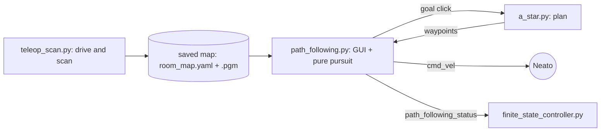
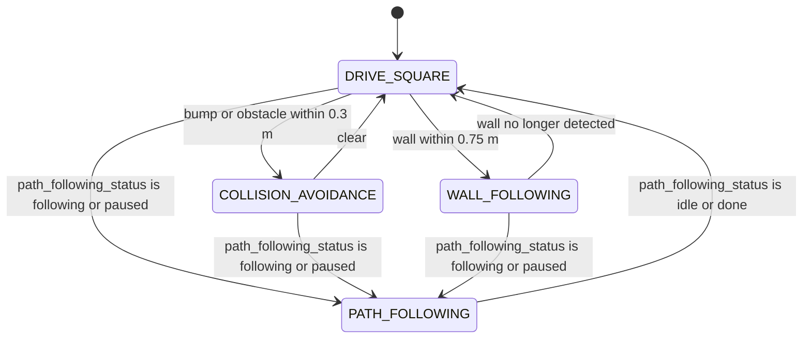

# RoboBehaviors and Finite State Machines Project

Author Names: Aditi Lagisetty and [teammate name]

For Olin ENGR3590 Computational Introduction to Robotics

## Project Overview

This project programs a Neato robot (ROS 2 Jazzy, Gazebo Harmonic) to run several behaviors and switch between them with a finite state machine. Assignment: [RoboBehaviors and FSMs](https://comprobo26.github.io/assignments/warmup_project).

The behaviors are:

| Behavior | File | Category |
|---|---|---|
| Drive a 1 m square | `drive_square.py` | Fundamental (in class) |
| Collision avoidance with obstacle steering | `collision_avoidance.py` | Basic (in class) |
| Wall following | `wall_follower.py` | Advanced (in class) |
| Mapping, A* planning and path following | `teleop_scan.py`, `room_map.py`, `a_star.py`, `path_following.py` | **Self-designed** |

The finite state machine in `finite_state_controller.py` combines all four. Three of its states are implemented inside the FSM node itself; the fourth (path following) is a separate node that the FSM hands control to.

Key design choices, each explained in the sections below:

- **Closed-loop motion instead of timing.** The simulator's wheel-acceleration limit makes timed "drive, then stop" commands drift, so `drive_square.py` uses odometry feedback and proportional control.
- **Potential fields for collision avoidance.** The robot steers around obstacles it can see coming and keeps a hard stop only as a last resort.
- **A separate node for path following, chained into the FSM.** It has its own GUI and its own safety pausing, so the FSM steps aside while it drives instead of competing with it for `cmd_vel`.



## Individual Behaviors

### Behavior 1: Drive in a Square

**What it does.** [drive_square.py](ros_behaviors_fsm/drive_square.py) drives the Neato around a 1 m x 1 m square: forward 1 m, turn left 90 degrees, four times. It stops if something comes within 0.5 m of the front of the robot or if a message arrives on the `estop` topic, and it resumes when the condition clears.

**Implementation.** The node subscribes to `odom` (`nav_msgs/Odometry`), `scan` (`sensor_msgs/LaserScan`) and `estop` (`std_msgs/Bool`), and publishes `cmd_vel`. Each leg uses proportional control on the *remaining* distance or angle: forward speed is capped at 0.1 m/s (gain 0.5), turn rate at 0.2 rad/s (gain 1.0), and both taper toward a small minimum near the target. Progress is measured from odometry (position for legs, yaw for turns, with angle wraparound handled). After every motion the node commands zero velocity and waits one second (`settle()`) so the robot is fully stopped before the next motion starts.

**Design decisions.**

- *Odometry instead of timing.* The class's timed sample undershot in Gazebo. The Neato model's diff-drive plugin sets `max_wheel_acceleration` to 1.0 rad/s^2, so the robot needs about a second to reach the commanded speed, and a fixed sleep does not account for that.
- *Proportional control instead of a hard stop.* Commanding zero the instant the target is reached still overshoots, because the wheels also decelerate slowly. An offline simulation of the acceleration limit predicted about +8.8 degrees of overshoot per turn at constant speed, versus about -0.5 degrees with the proportional controller, which is why we ramp speed down near the target.
- *Settle pause.* Without it a turn started while the robot was still coasting forward, producing an arc instead of a pivot.
- *Multi-threaded.* The drive sequence runs on its own `threading.Thread` and blocks on short sleeps, while `rclpy.spin` handles the e-stop and scan callbacks on the main thread. That keeps the e-stop responsive without extra bookkeeping. `manual_estop` and `obstacle_close` are separate flags combined in `stopped()`, so each can clear independently and the robot can resume. (The class sample latched the stop forever; this fixes that.)

**Results.** In one Gazebo run the node reported every leg within 0.02 m of 1 m (0.98 m) and every turn within about 1 degree of 90 (89.0 to 89.2), with no segment cut short. RViz, drawing from `/odom` and TF, showed a clean square. The Gazebo 3D viewport looked wrong in the same run and we did not determine why. One caveat: the diff-drive plugin computes `/odom` from wheel motion, so it is not an independent ground truth and would not reveal wheel slip.

**Demo.** Bag: TODO (`bags/drive_square_demo`).

### Behavior 2: Collision Avoidance and Obstacle Avoidance

**What it does.** [collision_avoidance.py](ros_behaviors_fsm/collision_avoidance.py) combines two behaviors that the assignment lists separately: a hard e-stop, and steering around obstacles so the robot keeps moving. Bump or a reading closer than 0.3 m ahead stops the robot. Anything within 1.0 m otherwise pushes it away from the obstacle while it keeps driving.

**Implementation.** The node subscribes to `bump` and `scan` and publishes `cmd_vel` plus a `visualization_msgs/Marker` arrow (`collision_avoidance_force`) showing the net force in RViz. The hard stop looks at the closest valid reading in a +/-10 degree cone ahead, not a single ray. Otherwise it builds a potential field: a constant forward pull plus, for every scan point closer than 1.0 m, a push away from that point with magnitude `k_repulsive * (1/r - 1/1.0)`, which grows as the obstacle gets closer and is zero at 1.0 m. The heading of the summed force, `atan2(net_y, net_x)`, drives a proportional steering command clamped to 1.0 rad/s. Forward speed is 0.1 m/s scaled by `1 / (1 + |repulsion|)`, and drops to zero if the net force points backward.

**Design decisions.**

- *Stop and steer in one node.* A hard stop is right when something is already too close for steering to help. The field handles everything farther out, so the robot reroutes early instead of driving up to an obstacle and stopping.
- *Slowdown scales with total repulsion, not just the forward component.* An obstacle directly to one side pushes almost entirely sideways, so the forward component alone would leave the robot at full speed while passing close to it. Scaling by the magnitude covers that side-swipe case.
- *No-return readings are ignored.* Readings of `0.0` mean "no return" on this lidar, so they are excluded rather than treated as an obstacle at distance zero.

**Status.** The logic is complete but `k_attractive`, `k_repulsive` and `k_steer` are still their initial value of 1.0 and have not been tuned in the simulator. The FSM's own `COLLISION_AVOIDANCE` state is a simpler separate implementation (see the FSM section).

**Demo.** Bag: TODO (`bags/collision_avoidance_demo`). It should show both a bump-triggered stop and a lidar-triggered stop.

### Behavior 3: Wall Following

**What it does.** The robot drives forward while keeping a set distance from a wall and staying parallel to it.

**Implementation.** Two implementations exist and they differ.

- [wall_follower.py](ros_behaviors_fsm/wall_follower.py) is the standalone node. It follows a wall on the robot's left, using the scan readings at 90 degrees (distance) and 45 and 135 degrees (alignment). `angular.z = kp * (side_reading - target) + kp * (front_diagonal - rear_diagonal)` with `kp = 0.5` and a 1.0 m target. If the front reading is 1.0 m or closer it stops and turns right (away from the wall); if any reading between 45 and 135 degrees is missing it drives forward while turning slowly left to look for the wall.
- The FSM's `WALL_FOLLOWING` state in [finite_state_controller.py](ros_behaviors_fsm/finite_state_controller.py) handles a wall on either side. It latches which side the wall is on (`follow_side`, +1 left and -1 right) and reads the same three angles mirrored to that side. The turn is `follow_side * (kp_distance * (side - 0.4) + kp_align * (front - rear))`, clamped to 0.5 rad/s.

**Design decisions.** The alignment term (`front - rear`) is zero when the robot is parallel, and if the nose points into the wall the front diagonal shrinks, which turns the robot away. Missing readings contribute zero error instead of a garbage correction. We checked the FSM version's steering directions against synthetic scans (left and right wall, too close, too far, nose toward the wall, a missing reading), and the sign is correct in each case.

**Status.** Neither version has been tuned or run against a wall in the simulator, and neither publishes the wall-detection `Marker` the assignment asks for. The two use different target distances (1.0 m versus 0.4 m), so they will not behave identically.

**Demo.** Bag: TODO (`bags/wall_follower_demo`, recorded together with the wall marker topic).

### Behavior 4: Mapping, A* Planning and Path Following (self-designed)

This is our self-designed behavior. It lets a person drive the robot around a room once to build a map, then either draw a route on the map or click a goal and have the robot plan and drive it.

**Mapping.** [teleop_scan.py](ros_behaviors_fsm/teleop_scan.py) drives the robot from the keyboard (`w/s/a/d/q/e`, space to stop, `+/-` for speed, `m` to save) while [room_map.py](ros_behaviors_fsm/room_map.py) builds an occupancy grid from the lidar. Each scan updates a log-odds grid: cells along a beam become more likely free, and the cell where it ends becomes more likely occupied. The grid is published on `room_map` for RViz and saved as a standard PGM plus YAML pair (default `~/.ros/room_map.yaml`) in the `odom` frame.

**Planning.** [a_star.py](ros_behaviors_fsm/a_star.py) plans over that saved map. Occupied cells are first inflated by the robot's radius, so a path keeps the whole robot clear of walls and not just its center. A* then searches 8-connected cells (diagonal steps cost sqrt(2)) using straight-line distance as the estimate, and returns waypoints in world coordinates. In offline tests on synthetic maps it routes through a doorway wide enough for the robot, refuses one that is too narrow, and returns nothing when the goal is walled off.

**Following.** [path_following.py](ros_behaviors_fsm/path_following.py) opens a Tkinter window showing the map. Drag with the left button to draw a route, then press *Go*; or right-click a goal and press *Plan (A\*)*. If a hand-drawn route crosses an obstacle, the node falls back to A* toward the same destination instead of refusing. Waypoints are resampled (0.15 m spacing) and smoothed, then followed with pure pursuit: aim at the point 0.3 m ahead along the path, steer proportionally (gain 1.5), turn in place when the heading error exceeds 50 degrees, and slow down near the goal. It pauses on a bump, an e-stop, or anything within 0.25 m ahead, and resumes when clear. It publishes the path on `drawn_path` and its state (`idle`, `following`, `paused`, `done`) on `path_following_status`.

**Design decisions.**

- *Pure pursuit* was chosen for its simplicity and because it tolerates the small heading errors from a differential-drive robot without needing a full trajectory controller.
- *Inflating obstacles once, before the search,* keeps the search itself cheap. The alternative, checking the robot's footprint at every visited cell, would repeat the same work many times.
- *Threading.* `rclpy.spin` runs on a background thread here, because Tkinter's `mainloop` (and, in `teleop_scan.py`, the blocking keyboard loop) need the main thread. This is the reverse of `drive_square.py`, where the work is threaded off and ROS stays on the main thread.

**Localization (in progress).** [icp_localizer.py](ros_behaviors_fsm/icp_localizer.py) and [icp_matching.py](ros_behaviors_fsm/icp_matching.py) correct odometry drift by matching the live scan against the saved map. `icp_align` starts from the odometry-based pose and repeats up to 20 times: place the scan on the map, pair each scan point with its nearest occupied map point (dropping pairs over 0.5 m apart), then solve for the shift and rotation that best line the pairs up (a closed-form 2D solution, no SVD). The localizer only moves halfway toward the ICP answer (`gain = 0.5`) and rejects a match if too few points matched, the error is large, or the jump is large. It publishes `localized_pose`, the `map -> odom` transform, and `localization_confident`, a `Bool` that is true when at least 4 of the last 5 scans passed those checks.

It was tested offline on a synthetic room with a simulated lidar, and end to end with the node against a saved map of that room. It recovered the pose to about 1 mm with a 1 cm map and about 3 cm with a 5 cm map (roughly half a map cell), converges from a starting error of up to about 0.4 m and 0.3 rad, and `localization_confident` went false on scans from the wrong place and true again afterwards. It has not been run on a real map from Gazebo or the physical Neato, and the FSM does not use `localization_confident` yet.

**Testing.** A* was tested offline as described above. The mapping and path-following nodes were run in Gazebo and recorded: [bags/teleop_scan_demo](bags/teleop_scan_demo) (40 s, includes `/room_map` and `/scan`) and [bags/path_following_demo](bags/path_following_demo) (56 s, includes `/drawn_path`, `/path_following_status` and `/cmd_vel`). No bump events occurred in either recording, so the pause-on-obstacle behavior is not shown in them. Play them back with `ros2 bag play bags/<name> --clock`.

## Finite State Machine

### Overall Design

The FSM starts in `DRIVE_SQUARE`, reacts to obstacles and walls, and yields to path following whenever that node is driving.



| State | What the robot does |
|---|---|
| `DRIVE_SQUARE` | Drives a 1 m square with timed legs (5 s forward, 2 s turn), then stops after the fourth turn. |
| `COLLISION_AVOIDANCE` | Backs away at 0.05 m/s while turning (0.3 rad/s) toward whichever front diagonal (+/-45 degrees) has more clearance. |
| `WALL_FOLLOWING` | Follows the latched wall using the steering law in Behavior 3. |
| `PATH_FOLLOWING` | Publishes nothing; `path_following.py` is driving. |

**Transitions.** Bump comes from the `bump` topic and obstacle detection from the closest reading in a +/-10 degree cone ahead (under 0.3 m). Wall detection is a reading under 0.75 m at +/-90 degrees. The `PATH_FOLLOWING` check runs first on every tick, so it preempts whatever state the FSM is in, and it can only return to `DRIVE_SQUARE`. The two reactive states never connect to each other; both return to `DRIVE_SQUARE` once their trigger clears.

### Implementation Details

`finite_state_controller.py` is one node with a `State` enum, a `self.state` variable, and a 10 Hz timer calling `run_loop`. Sensor callbacks (`process_bump`, `process_scan`, `process_path_following_status`) only update variables. Each tick, `run_loop` first picks the next state from those variables, then calls one handler (`handle_drive_square`, `handle_collision_avoidance`, `handle_wall_following` or `handle_path_following`) that publishes the velocity for that state.

**Coding strategy.** The assignment lists three ways to build an FSM: reimplement behaviors in one node, use libraries, or chain parallel nodes. We used two of them. `DRIVE_SQUARE`, `COLLISION_AVOIDANCE` and `WALL_FOLLOWING` are reimplemented inline, as simplified versions of the standalone nodes above (not calls into them). `PATH_FOLLOWING` chains a separate node: `path_following.py` keeps its own `cmd_vel` publisher and safety logic and reports its state on `path_following_status`, and while that state is active the FSM's handler deliberately publishes nothing. We chose this because `path_following.py` owns a GUI, a saved map and its own pause logic, and two nodes reacting to the same sensors and publishing conflicting `cmd_vel` messages would be worse than either alone.

### Capabilities and Limitations

- The transition into `PATH_FOLLOWING` is not triggered by anything the robot senses. It starts when a person presses *Go* or *Plan (A\*)* in the GUI, which the FSM only sees through the status topic. The assignment asks for transitions that can be detected in the environment, so we note this as a real limitation of the design.
- The FSM's `DRIVE_SQUARE` is the timed version, so it inherits the drift described in Behavior 1 (the odometry-based `drive_square.py` is not used inside the FSM), and after the fourth turn it just idles.
- The standalone behavior nodes (`drive_square`, `collision_avoidance`, `wall_follower`) publish `cmd_vel` themselves and must not run at the same time as the FSM or each other.
- `follow_side` is only cleared when no wall is visible on either side, so it can stay latched to a wall that has disappeared while the other side still triggers detection. Missing readings contribute zero error, which keeps this from producing a wild command, but the robot may not steer toward the wall that is actually there.
- The FSM has not been run end to end in the simulator, so the handoff to `PATH_FOLLOWING` and the reactive transitions are untested at runtime.

### Demonstration

TODO: FSM run with a path started mid-drive and an obstacle introduced (`bags/finite_state_controller_demo`). The path-following handoff signal itself, `/path_following_status`, is present in [bags/path_following_demo](bags/path_following_demo).

## Learning Objectives and Final Takeaways

**Individual learning objectives.**

- Aditi: TODO
- [Teammate]: TODO

**Challenges.**

- Timed motion did not survive contact with the simulator's acceleration limits. Finding that took logging target versus actual for every leg (the printed lines showed errors of a few centimeters and about a degree once it was fixed).
- The first several explanations for "the square looks wrong" were about our controller. The controller was fine by odometry and RViz; what looked wrong was the Gazebo viewport. We never established why, which is a reminder that `/odom` in simulation is derived from the same wheel model and is not independent ground truth.
- Behaviors written separately can collide. Several nodes publishing `cmd_vel` at once is easy to create by accident and needs an explicit handoff.
- The same pitfall appeared in several files: a `0.0` lidar reading means "no return", not "obstacle at zero distance". It was handled in some files first and had to be fixed in others.

**What we would do with more time.**

- Tune the gains in `collision_avoidance.py` and the FSM's wall-following state against real runs, and unify the two wall-following implementations.
- Run the ICP localizer against a real map from Gazebo and the physical Neato, use the corrected pose in path following, and use `localization_confident` as a sensed trigger in the FSM.
- Make the FSM's `DRIVE_SQUARE` odometry-based, and add a sensed trigger for path following (for example, starting it when a goal is published on a topic).
- Add the wall-detection `Marker`, and record bags for the drive square, collision avoidance, wall following and the FSM.
- Test everything on the physical Neato.

**Takeaways.**

1. *Close the loop when the actuator has dynamics.* If the plant accelerates and decelerates slowly, open-loop timing fails silently. Measuring progress and tapering speed fixed what tuning the timing could not.
2. *Check a surprising result against a second source before changing code.* The viewport, RViz and the controller's own log disagreed, and comparing them told us which one to distrust.
3. *Give every actuator one owner at a time.* When independently written behaviors share `cmd_vel`, decide explicitly who is in control, as the FSM does with `path_following_status`.
4. *Test the math offline with synthetic data.* The A* planner and the wall-following steering signs were checked against fake maps and fake scans, which caught mistakes in our own test setup as well as in the code, without waiting for a simulator run.
5. *Chaining nodes is a legitimate FSM design.* When a behavior's architecture (a GUI, a map, its own safety logic) does not fit the others, handing off to it beats reimplementing it, as long as the handoff is clean.

## How To Run

Prerequisites: ROS 2 Jazzy, the `neato_packages` workspace (`neato2_gazebo`, `neato2_interfaces`, ...), `numpy`, `pyyaml` and Tkinter.

1. Clone this repo into `~/ros2_ws/src/`, then build and source:
   ```bash
   cd ~/ros2_ws
   colcon build --packages-select ros_behaviors_fsm
   source install/setup.bash
   ```
2. Start a simulated world (in its own terminal):
   ```bash
   ros2 launch neato2_gazebo neato_maze.py      # or empty_world.py, neato_gauntlet_world.py
   ```
3. Run one behavior at a time (each publishes `cmd_vel`, so do not run two together):
   ```bash
   ros2 run ros_behaviors_fsm drive_square
   ros2 run ros_behaviors_fsm collision_avoidance
   ros2 run ros_behaviors_fsm wall_follower
   ros2 run ros_behaviors_fsm finite_state_controller
   ```
4. Mapping and path following:
   ```bash
   ros2 run ros_behaviors_fsm teleop_scan       # drive around, press m to save, Ctrl-C to quit
   ```
   The map is stored in the odometry frame, so restart the simulator so the robot begins at the same pose it had when you scanned, then:
   ```bash
   ros2 run ros_behaviors_fsm path_following    # left-drag to draw + Go, or right-click a goal + Plan (A*)
   ```
   To see the FSM hand off to path following, run `finite_state_controller` in a third terminal alongside it.
5. Record a demo, and play one back (use `--clock`, and disconnect from the robot first):
   ```bash
   ros2 bag record /accel /bump /odom /cmd_vel /scan /stable_scan /projected_stable_scan /tf /tf_static -o bags/<name>
   ros2 bag play bags/<name> --clock
   ```

## Repository Contents

| Path | Purpose |
|---|---|
| `ros_behaviors_fsm/drive_square.py` | Odometry-based square driving with e-stop |
| `ros_behaviors_fsm/collision_avoidance.py` | Hard stop plus potential-field steering |
| `ros_behaviors_fsm/wall_follower.py` | Standalone left-wall follower |
| `ros_behaviors_fsm/finite_state_controller.py` | The state machine |
| `ros_behaviors_fsm/teleop_scan.py`, `room_map.py` | Keyboard driving and occupancy-grid mapping |
| `ros_behaviors_fsm/a_star.py` | A* planner with obstacle inflation |
| `ros_behaviors_fsm/path_following.py` | Path GUI, planning entry points, pure-pursuit follower |
| `ros_behaviors_fsm/icp_localizer.py`, `icp_matching.py` | ICP localization against the saved map (tested on synthetic data, not yet on a real map) |
| `ros_behaviors_fsm/angle_helpers.py` | Quaternion to Euler conversion |
| `bags/` | Recorded runs (`teleop_scan_demo`, `path_following_demo`) |

## Status (delete before submitting)

Still open at the time of writing:

- [ ] Bags still to record: `test_drive`, `drive_square_demo`, `collision_avoidance_demo` (needs both a bump-triggered and a lidar-triggered stop), `wall_follower_demo` (also record the wall marker topic), `finite_state_controller_demo`. Already done: `path_following_demo`, `teleop_scan_demo`.
- [ ] Wall-detection `Marker` (required by the assignment for wall following).
- [ ] Run the FSM end to end in the simulator, and tune the collision-avoidance and wall-following gains.
- [ ] Test on the physical Neato.
- [ ] Add gifs or video for each behavior; fill in the teammate name and individual learning objectives.
