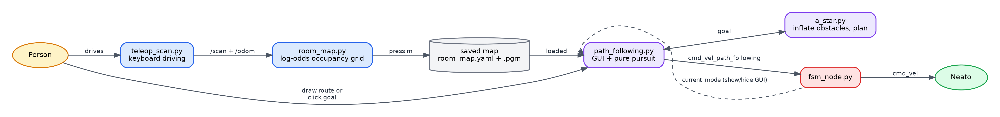
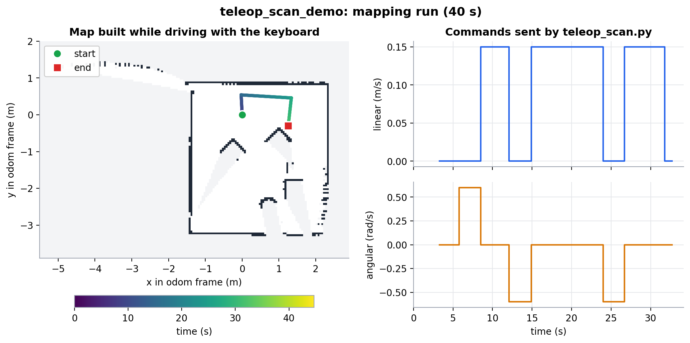
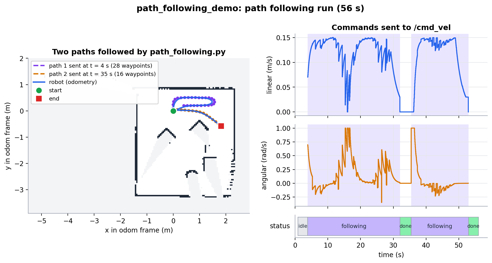

# RoboBehaviors and Finite State Machines Project

**Author Names:** Aditi, Duc, and Akil

**Course:** Olin ENGR3590 Computational Introduction to Robotics

**Assignment:** [RoboBehaviors and Finite State Machines](https://comprobo26.github.io/assignments/warmup_project)

## Project Overview

This project programs a Neato robot (ROS 2 Jazzy, Gazebo Harmonic) to run several behaviors and switch between them with a finite state machine. The assignment asks for a set of reactive behaviors (stopping for obstacles, driving a shape, following a wall, and at least one of our own design) and a state machine that chooses among them. This repository is our solution. The drive-square, mapping and path-following nodes have been run in the Gazebo simulator, and (per the commit history) so were the standalone collision-avoidance and wall-following nodes, with mixed results described below. The state machine as a whole has not been run, and nothing has been tested on the physical robot. [What We Verified](#what-we-verified) lists exactly what was checked and how.

The behaviors are:

| Behavior | File | Category |
|---|---|---|
| Drive a 1 m square | `drive_square.py` | Fundamental (in class) |
| Collision avoidance with obstacle steering | `collision_avoidance.py` | Basic (in class) |
| Wall following | `wall_follower.py` | Advanced (in class) |
| Mapping, A* planning and path following | `teleop_scan.py`, `room_map.py`, `a_star.py`, `path_following.py` | **Self-designed** |

The finite state machine in `finite_state_controller.py` combines all four. Three of its states are implemented inside the FSM node itself; the fourth (path following) is a separate node that the FSM hands control to.

Key design choices, each explained in the sections below:

- **Closed-loop motion instead of timing.** The simulator's wheel-acceleration limit makes timed "drive, then stop" commands drift, so `drive_square.py` uses odometry feedback and proportional control.
- **Potential fields for collision avoidance.** The robot steers around obstacles it can see coming and keeps a hard stop only as a last resort.
- **A separate node for path following, chained into the FSM.** It has its own GUI and its own safety pausing, so the FSM steps aside while it drives instead of competing with it for `cmd_vel`.

**Summary of takeaways.** Motion that depends on timing did not survive the simulator's acceleration limits and had to be closed with odometry feedback. When several behaviors share `cmd_vel`, exactly one has to own it at a time. Chaining a separate node into the state machine works as long as the handoff is explicit. The details are in [Learning Objectives and Final Takeaways](#learning-objectives-and-final-takeaways).



*Figure 1. The self-designed behavior (Behavior 4). Blue: mapping. Purple: planning and following. The dashed line is the only connection to the state machine.*

## Individual Behaviors

### Behavior 1: Drive in a Square

**What it does.** [drive_square.py](ros_behaviors_fsm/drive_square.py) drives the Neato around a 1 m x 1 m square: forward 1 m, turn left 90 degrees, four times. It stops if something comes within 0.5 m of the front of the robot or if a message arrives on the `estop` topic, and it resumes when the condition clears.

**Implementation.** The node subscribes to `odom` (`nav_msgs/Odometry`), `scan` (`sensor_msgs/LaserScan`) and `estop` (`std_msgs/Bool`), and publishes `cmd_vel`. Each leg uses proportional control on the *remaining* distance or angle: forward speed is capped at 0.1 m/s (gain 0.5), turn rate at 0.2 rad/s (gain 1.0), and both taper toward a small minimum near the target. Progress is measured from odometry (position for legs, yaw for turns, with angle wraparound handled). After every motion the node commands zero velocity and waits one second (`settle()`) so the robot is fully stopped before the next motion starts.

**Design decisions.**

- *Odometry instead of timing.* The class's timed sample undershot in Gazebo. The Neato model's diff-drive plugin sets `max_wheel_acceleration` to 1.0 rad/s^2, so the robot needs about a second to reach the commanded speed, and a fixed sleep does not account for that.
- *Proportional control instead of a hard stop.* Commanding zero the instant the target is reached still overshoots, because the wheels also decelerate slowly. An offline simulation of the acceleration limit predicted about +8.8 degrees of overshoot per turn at constant speed, versus about -0.5 degrees with the proportional controller, which is why we ramp speed down near the target.
- *Settle pause.* Without it a turn started while the robot was still coasting forward, producing an arc instead of a pivot.
- *Multi-threaded.* The drive sequence runs on its own `threading.Thread` and blocks on short sleeps, while `rclpy.spin` handles the e-stop and scan callbacks on the main thread. That keeps the e-stop responsive without extra bookkeeping. `manual_estop` and `obstacle_close` are separate flags combined in `stopped()`, so each can clear independently and the robot can resume. (The class sample latched the stop forever; this fixes that.)

**Results.** In one Gazebo run the node reported every leg within 0.02 m of 1 m (0.98 m) and every turn within about 1 degree of 90 (89.0 to 89.2), with no segment cut short. RViz, drawing from `/odom` and TF, showed a clean square. The Gazebo 3D viewport looked wrong in the same run and we did not determine why. One caveat: the diff-drive plugin computes `/odom` from wheel motion, so it is not an independent ground truth and would not reveal wheel slip.

**Demo.** Bag: TODO (`bags/drive_square_demo`).

### Behavior 2: Collision Avoidance and Obstacle Avoidance

**What it does.** [collision_avoidance.py](ros_behaviors_fsm/collision_avoidance.py) combines two behaviors that the assignment lists separately: a hard e-stop, and steering around obstacles so the robot keeps moving. Bump or a reading closer than 0.3 m ahead stops the robot. Anything within 1.0 m otherwise pushes it away from the obstacle while it keeps driving.

**Implementation.** The node subscribes to `bump` and `scan` and publishes `cmd_vel` plus a `visualization_msgs/Marker` arrow (`collision_avoidance_force`) showing the net force in RViz. The hard stop looks at the closest valid reading in a +/-10 degree cone ahead, not a single ray. Otherwise it builds a potential field: a constant forward pull plus, for every scan point closer than 1.0 m, a push away from that point with magnitude `k_repulsive * (1/r - 1/1.0)`, which grows as the obstacle gets closer and is zero at 1.0 m. The heading of the summed force, `atan2(net_y, net_x)`, drives a proportional steering command clamped to 1.0 rad/s. Forward speed is 0.1 m/s scaled by `1 / (1 + |R|)`, where `|R|` is the length of the repulsion (the net force minus the constant forward pull, so open space gives the full 0.1 m/s), and drops to zero if the net force points backward.

**Design decisions.**

- *Stop and steer in one node.* A hard stop is right when something is already too close for steering to help. The field handles everything farther out, so the robot reroutes early instead of driving up to an obstacle and stopping.
- *Slowdown scales with the whole repulsion vector, not just its forward component.* An obstacle directly to one side pushes almost entirely sideways, so the forward component alone would leave the robot at full speed while passing close to it. Scaling by the vector's length covers that side-swipe case.
- *No-return readings are skipped.* The simulator reports "no return" as `inf` (in the recorded bags about 1% of readings are `inf` and none are exactly `0.0`), and the code skips any reading that is not finite or not positive, so a missing reading is never treated as an obstacle at distance zero.

**Status: three bugs found and fixed in the code; not yet re-run in Gazebo.** The commit history records the original failure ("Collision avoidance is not working, the neato doesnt move forward"). We reproduced it offline by giving the node scans laid out like the simulator's, and found three causes:

1. *The scan is indexed from the wrong direction.* The simulator's `/scan` has 361 rays and `angle_min = -pi`, but the lidar is mounted rotated by 180 degrees in the robot model (`neato_with_camera.sdf`), so ray 0 points at the front of the robot, not ray 180. We confirmed this two ways from the recorded bags. Treating ray 0 as the front makes the hits from many scans line up on the same walls (2,395 distinct 5 cm cells, versus 6,223 when `angle_min` is applied), and while the robot drives straight forward the range at ray 180 grows by 1.00 m per meter driven. The code turned a ray index into an angle with `angle_min + i * increment`, so it treated ray 180 as the front. The hard-stop cone looked behind the robot (an obstacle 0.25 m ahead did not trigger it, and the robot kept creeping forward), and the whole force field was rotated 180 degrees (a wall on the left pushed the robot into it).
2. *The slowdown counted the forward pull as repulsion.* After the latest commit the length used for the slowdown included the constant attraction, so open space gave 0.05 m/s instead of 0.10.
3. *The repulsion is a sum over every ray, while the attraction is one constant.* With `k_repulsive = 1.0`, a wall 0.5 m to one side cut the forward speed to about 0.002 m/s, so the robot effectively did not move near walls.

**The fixes.** Ray `i` is now at angle `i * angle_increment` from the front, both in `_range_at_angle` (wrapping at 360 rays per turn, not 361) and in the force sum. The slowdown again subtracts the forward pull, and `k_repulsive` is 0.02 as a starting value. On scans laid out like the simulator's this gives 0.10 m/s in open space, a hard stop for an obstacle 0.25 m ahead, and a turn away from a wall 0.5 m to either side at 0.055 m/s. On the 480 real scans in the two bags, the hard-stop cone matched the ray-0 window every time. The FSM's own `COLLISION_AVOIDANCE` state is a simpler separate implementation; it had the same scan-indexing bug, now fixed (see the FSM section).

**Two more bugs found and fixed live in Gazebo, 2026-09-22.** A teammate reported obstacle avoidance "just rams into the object" (the topic-mismatch fix in `fsm_node.py`, above, addressed that one) and separately asked whether it steers around obstacles or just stops. Testing that directly, facing the robot at an obstacle dead-on and letting it run:

1. *A symmetric obstacle produced a maxed-out, flip-flopping turn with no forward motion.* An obstacle straight ahead is the same distance on both sides of center, so the un-rotated repulsion summed to a vector pointing almost exactly backward. `atan2(net_y, net_x)` then sits on the +/-pi discontinuity, where floating-point noise flips the sign every scan -- confirmed live: `angular.z` alternated between the +1.0 and -1.0 rad/s clamp while `linear.x` stayed 0, and the robot's true position (checked directly against the simulator, not `/odom`) did not move for 10 straight seconds. Fixed by rotating every repulsive contribution in `compute_potential_field` by a fixed 20-degree bias (`self.repulsion_bias_angle`), so a symmetric obstacle no longer produces a force sitting exactly on that discontinuity -- verified offline first (the same symmetric input now gives a consistent heading every time, across several distances, with no change to the open-space or single-sided-obstacle cases), then live (the robot turned one direction and stayed turning, instead of alternating).
2. *Even with that fixed, the robot could still get stuck at a distance right at the hard-stop threshold.* Steering moved it just far enough to clear the threshold, the very next scan put it right back under it, and `cmd_vel` ended up alternating between a real command and an exact `(0, 0)` on almost every single message. With the wheels' real acceleration limit (see Behavior 1), each between-stops command was too short-lived to ever build actual speed, so the robot again did not move, confirmed the same way. Fixed with hysteresis: `stop_distance_clear` (0.4 m) and `side_stop_distance_clear` (0.32 m) are now required to *release* a hard stop, wider than the 0.3 m/0.22 m that *trigger* one. Re-verified live in the same scenario: the robot moved a real 0.4 m away and its distance to the obstacle grew from 0.4 m to just over 1.0 m in 15 s, instead of staying flat.

One design limit remains, not yet tested: the hard stop still has no recovery motion once it does hold (bump, or something within the tighter thresholds even after hysteresis) -- it just stops and waits for the obstacle to move or clear on its own.

**Current problem: this node does not move the robot when run alone.** It now publishes to `cmd_vel_collision_avoidance`, not `cmd_vel` -- confirmed live: running `ros2 run ros_behaviors_fsm collision_avoidance` by itself in Gazebo leaves `/cmd_vel` with zero publishers. The rename was made to feed the new gateway node (`fsm_node.py`, see [Finite State Machine](#a-second-in-progress-fsm-fsm_nodepy)); that gateway originally subscribed to a different topic name (`cmd_vel_obstacle_avoidance`), so the two did not connect there either, until we fixed the name mismatch (see What We Verified). It still needs `fsm_node.py` running to reach the robot at all -- there is no way to see collision avoidance move the robot with just this one node.

**Demo.** [bags/collision_avoidance_demo](bags/collision_avoidance_demo) shows real motion, but it was recorded with a build from before the `cmd_vel_collision_avoidance` rename that has since been rebuilt away (see What We Verified); it does not reflect the code in the repository now. No bump-triggered stop appears in it (`/bump` has 0 messages).

### Behavior 3: Wall Following

**What it does.** The robot drives forward while keeping a set distance from a wall and staying parallel to it.

**Implementation.** Two implementations exist and they differ.

- [wall_follower.py](ros_behaviors_fsm/wall_follower.py) is the standalone node. It follows the closer of the two side walls (the left if only the left is visible or both are equally close, otherwise the right; it re-picks on every scan). It uses three readings on that side, at 90 degrees (distance) and 45 and 135 degrees (alignment), read directly by index (0 is the front, 90 the left, 270 the right, which matches the simulator's scan layout). `angular.z = kp * (side_reading - target) + kp * (front_diagonal - rear_diagonal)` for a left wall, and the negative of that for a right wall, with `kp = 0.5` and a 1.0 m target. If the front reading is 0.8 m or closer it stops and turns away from the wall at 0.4 rad/s; if any of the three readings is missing it drives forward at 0.1 m/s while turning slowly (0.1 rad/s) toward the wall's side to look for it.
- The FSM's `WALL_FOLLOWING` state in [finite_state_controller.py](ros_behaviors_fsm/finite_state_controller.py) handles a wall on either side. It latches which side the wall is on (`follow_side`, +1 left and -1 right) and reads the same three angles mirrored to that side. The turn is `follow_side * (kp_distance * (side - 0.4) + kp_align * (front - rear))`, clamped to 0.5 rad/s.

**Design decisions.** The alignment term (`front - rear`) is zero when the robot is parallel, and if the nose points into the wall the front diagonal shrinks, which turns the robot away. Missing readings contribute zero error instead of a garbage correction. We checked the steering directions against synthetic scans. The standalone version steers correctly on both sides (wall parallel at the target, too close, too far) and turns away from an obstacle ahead. The FSM version now does too with the simulator's real scan layout; before the scan-indexing fix described under Behavior 2 it steered the wrong way in every case we tried.

**Status.** According to the commit history the standalone version was run in the simulator ("Woks on both sides, but it is a bit choppy"); there is no bag of it yet. One possible cause of the choppiness that we did not test is that it re-picks the side on every scan, so it can switch walls when both are in range. It also still has unused variables (`is_turning`, `turn_start_time`, `turn_duration`), prints debug lines on every scan, and only filters `inf` and `nan` for the three wall readings, so a `0.0` reading would count as a wall at zero distance. The simulator does not produce `0.0` readings, but we have not checked the physical robot.

The FSM version had the scan-layout problem described under Behavior 2: with the simulator's layout it picked the opposite side and turned away from a wall that was too far and toward one that was too close, for both left and right walls. That is fixed, and on synthetic scans it now picks the right side and steers correctly on both. It has not been tuned or run in Gazebo with a real wall. Neither version publishes the wall-detection `Marker` the assignment asks for, and the two use different target distances (1.0 m versus 0.4 m), so they will not behave identically.

**Current problem: this node does not move the robot when run alone, as documented.** Like `collision_avoidance.py`, it now publishes to `cmd_vel_wall_follower`, not `cmd_vel` -- confirmed live, `/cmd_vel` had zero publishers while it ran by itself. It does work when run together with the new `fsm_node.py` gateway (see [Finite State Machine](#a-second-in-progress-fsm-fsm_nodepy)): with no wall in range it drove forward while searching, and `fsm_node.py` correctly forwarded that to `/cmd_vel`. That combination is not what the "How To Run" section currently describes, though, and `fsm_node.py`'s own launch file does not work yet either.

**Demo.** [bags/wall_follower_demo](bags/wall_follower_demo) has the same stale-build issue as `bags/collision_avoidance_demo` (see What We Verified); it does not reflect the code in the repository now. It also has no wall marker topic.

### Behavior 4: Mapping, A* Planning and Path Following (self-designed)

This is our self-designed behavior. It lets a person drive the robot around a room once to build a map, then either draw a route on the map or click a goal and have the robot plan and drive it.

**Mapping.** [teleop_scan.py](ros_behaviors_fsm/teleop_scan.py) drives the robot from the keyboard (`w/s/a/d/q/e`, space to stop, `+/-` for speed, `m` to save) while [room_map.py](ros_behaviors_fsm/room_map.py) builds an occupancy grid from the lidar. Each scan updates a log-odds grid: cells along a beam become more likely free, and the cell where it ends becomes more likely occupied. The grid is published on `room_map` for RViz and saved as a standard PGM plus YAML pair (default `~/.ros/room_map.yaml`) in the `odom` frame.

**Planning.** [a_star.py](ros_behaviors_fsm/a_star.py) plans over that saved map. Occupied cells are first inflated by the robot's radius, so a path keeps the whole robot clear of walls and not just its center. A* then searches 8-connected cells (diagonal steps cost sqrt(2)) using straight-line distance as the estimate, and returns waypoints in world coordinates. In offline tests on synthetic maps it routes through a doorway wide enough for the robot, refuses one that is too narrow, and returns nothing when the goal is walled off. With the follower's 0.28 m safety radius (6 cells at 0.05 m per cell) a doorway has to be about 0.7 m wide: in a synthetic test 0.5 m was refused and 0.7 m was accepted. A start point inside the inflated zone (within 0.28 m of a wall) also returns no path, even though the robot is standing there.

**Following.** [path_following.py](ros_behaviors_fsm/path_following.py) opens a Tkinter window showing the map. Drag with the left button to draw a route, then press *Go*; or right-click a goal and press *Plan (A\*)*. If a hand-drawn route crosses an obstacle, the node falls back to A* toward the same destination instead of refusing. Waypoints are resampled (0.15 m spacing) and smoothed, then followed with pure pursuit: aim at the point 0.3 m ahead along the path, steer proportionally (gain 1.5), turn in place when the heading error exceeds 50 degrees, and slow down near the goal. It pauses on a bump, an e-stop, or anything within 0.25 m ahead, and resumes when clear. It publishes the path on `drawn_path` and its state (`idle`, `following`, `paused`, `done`) on `path_following_status`.

**Design decisions.**

- *Pure pursuit* was chosen for its simplicity and because it tolerates the small heading errors from a differential-drive robot without needing a full trajectory controller.
- *Inflating obstacles once, before the search,* keeps the search itself cheap. The alternative, checking the robot's footprint at every visited cell, would repeat the same work many times.
- *Threading.* `rclpy.spin` runs on a background thread here, because Tkinter's `mainloop` (and, in `teleop_scan.py`, the blocking keyboard loop) need the main thread. This is the reverse of `drive_square.py`, where the work is threaded off and ROS stays on the main thread.

**Localization (in progress).** [icp_localizer.py](ros_behaviors_fsm/icp_localizer.py) and [icp_matching.py](ros_behaviors_fsm/icp_matching.py) correct odometry drift by matching the live scan against the saved map. `icp_align` starts from the odometry-based pose and repeats up to 20 times: place the scan on the map, pair each scan point with its nearest occupied map point (dropping pairs over 0.5 m apart), then solve for the shift and rotation that best line the pairs up (a closed-form 2D solution, no SVD). The localizer only moves halfway toward the ICP answer (`gain = 0.5`) and rejects a match if too few points matched, the error is large, or the jump is large. It publishes `localized_pose`, the `map -> odom` transform, and `localization_confident`, a `Bool` that is true when at least 4 of the last 5 scans passed those checks.

It was tested offline on a synthetic room with a simulated lidar, and end to end with the node against a saved map of that room. It recovered the pose to about 1 mm with a 1 cm map and about 3 cm with a 5 cm map (roughly half a map cell), converges from a starting error of up to about 0.4 m and 0.3 rad, and `localization_confident` went false on scans from the wrong place and true again afterwards. It has not been run on a real map from Gazebo or the physical Neato, and the FSM does not use `localization_confident` yet.

**Testing.** A* was tested offline as described above. The mapping and path-following nodes were run in Gazebo and recorded: [bags/teleop_scan_demo](bags/teleop_scan_demo) (40 s, includes `/room_map` and `/scan`) and [bags/path_following_demo](bags/path_following_demo) (56 s, includes `/drawn_path`, `/path_following_status` and `/cmd_vel`). No bump events occurred in either recording, so the pause-on-obstacle behavior is not shown in them. Play them back with `ros2 bag play bags/<name> --clock`.



*Figure 2. `teleop_scan_demo`. Left: the final `/room_map` (dark = occupied, white = free, grey = unknown) with the `/odom` path colored by time. Right: the `/cmd_vel` commands. The keyboard only sends fixed steps, 0 or 0.15 m/s forward and turns of 0.6 rad/s.*



*Figure 3. `path_following_demo`. Two paths were sent (dashed) and the robot followed both (blue). Right: `/cmd_vel`, with the purple bands marking when `/path_following_status` was `following`, and the status over time below. The map comes from `teleop_scan_demo`; it lines up here because both bags start at the same odometry origin, as the run instructions require.*

What the data shows:

- Both paths finished (`done`). The robot stopped about 0.06 m from the last waypoint of path 1 and about 0.04 m from the last waypoint of path 2, inside the 0.08 m goal tolerance. The status never became `paused`.
- Around t = 14 to 17 s the robot is at the far end of path 1 (x of about 1.5 m), where the route doubles back. Linear speed falls to about 0.06 m/s and angular speed climbs to its 1.0 rad/s cap. That is the rule that slows the robot as heading error grows and turns it in place past 50 degrees.
- Path 2 starts (t = 36 s) with a pure turn, linear 0 and angular +1.0 rad/s, before the robot drives off. Computing it from the odometry, the robot faced about -91 degrees while the point 0.3 m ahead on the path was at about -3 degrees, a heading error of about 88 degrees. That is past the 50 degree threshold, so it turned in place until the error dropped below it (about 0.7 s later) and then started driving.
- The commands are jumpy while following, with brief dips in linear speed. We did not investigate the cause or smooth them, and the robot still completed both paths.

## Finite State Machine

### Overall Design

**Intended performance.** When the FSM runs, the Neato drives a 1 m square. While it is driving the square, if it bumps something or sees an obstacle less than 0.3 m ahead, it backs away while turning toward the side with more room, then goes back to the square once nothing is in the way. If a wall comes within 0.75 m on either side, it follows that wall until the wall is gone, then returns to the square. If someone starts a path in `path_following.py`, the FSM stops sending velocity commands so that node can drive, and takes over again with the square once the path is finished or cancelled. After the fourth turn of the square the robot stops and waits.


*Figure 4. The state machine. Solid arrows leave `DRIVE_SQUARE`, dashed arrows return to it. The purple `PATH_FOLLOWING` arrow is checked first on every tick and applies from any state.*

| State | What the robot does |
|---|---|
| `DRIVE_SQUARE` | Drives a 1 m square with timed legs (5 s forward, 2 s turn), then stops after the fourth turn. |
| `COLLISION_AVOIDANCE` | Backs away at 0.05 m/s while turning (0.3 rad/s) toward whichever front diagonal (+/-45 degrees) has more clearance. |
| `WALL_FOLLOWING` | Follows the latched wall using the steering law in Behavior 3. |
| `PATH_FOLLOWING` | Publishes nothing; `path_following.py` is driving. |

**Transitions.** Bump comes from the `bump` topic and obstacle detection from the closest reading in a +/-10 degree cone ahead (under 0.3 m). Wall detection is a reading under 0.75 m at +/-90 degrees. The `PATH_FOLLOWING` check runs first on every tick, so it preempts whatever state the FSM is in, and it can only return to `DRIVE_SQUARE`. The two reactive states never connect to each other; both return to `DRIVE_SQUARE` once their trigger clears.

### Implementation Details

`finite_state_controller.py` is one node with a `State` enum, a `self.state` variable, and a 10 Hz timer calling `run_loop`. Sensor callbacks (`process_bump`, `process_scan`, `process_path_following_status`) only update variables. Each tick, `run_loop` first picks the next state from those variables, then calls one handler (`handle_drive_square`, `handle_collision_avoidance`, `handle_wall_following` or `handle_path_following`) that publishes the velocity for that state.

**Coding strategy.** The assignment lists three ways to build an FSM: reimplement behaviors in one node, use libraries, or chain parallel nodes. We used two of them. `DRIVE_SQUARE`, `COLLISION_AVOIDANCE` and `WALL_FOLLOWING` are reimplemented inline, as simplified versions of the standalone nodes above (not calls into them). `PATH_FOLLOWING` chains a separate node: `path_following.py` keeps its own `cmd_vel` publisher and safety logic and reports its state on `path_following_status`, and while that state is active the FSM's handler deliberately publishes nothing. We chose this because `path_following.py` owns a GUI, a saved map and its own pause logic, and two nodes reacting to the same sensors and publishing conflicting `cmd_vel` messages would be worse than either alone.

### Capabilities and Limitations

- **Scan indexing (fixed; not yet re-run in Gazebo).** `_range_at_angle` used to convert an angle to a ray index using `angle_min`, but the simulator's front is ray 0 (see Behavior 2), so the FSM's obstacle, wall and clearance readings were 180 degrees off: an obstacle 0.2 m ahead did not leave `DRIVE_SQUARE`, one 0.2 m behind sent it to `COLLISION_AVOIDANCE`, a left wall was treated as a right wall, and `WALL_FOLLOWING` steered the wrong way. It now indexes from the front. With scans laid out like the simulator's, an obstacle ahead goes to `COLLISION_AVOIDANCE`, one behind is ignored, the wall side is right, and wall steering is correct on both sides. The transition logic itself already behaved as in Figure 4 (we stepped through 11 transitions; see What We Verified), so this was an input problem and not a logic problem.
- The transition into `PATH_FOLLOWING` is not triggered by anything the robot senses. It starts when a person presses *Go* or *Plan (A\*)* in the GUI, which the FSM only sees through the status topic. The assignment asks for transitions that can be detected in the environment, so we note this as a real limitation of the design.
- The FSM's `DRIVE_SQUARE` is the timed version, so it inherits the drift described in Behavior 1 (the odometry-based `drive_square.py` is not used inside the FSM), and after the fourth turn it just idles.
- The standalone behavior nodes (`drive_square`, `collision_avoidance`, `wall_follower`) publish `cmd_vel` themselves and must not run at the same time as the FSM or each other.
- `follow_side` is only cleared when no wall is visible on either side, so it can stay latched to a wall that has disappeared while the other side still triggers detection. Missing readings contribute zero error, which keeps this from producing a wild command, but the robot may not steer toward the wall that is actually there.
- Bump and obstacle are only checked while in `DRIVE_SQUARE`. While the robot is in `WALL_FOLLOWING` nothing stops it from driving into something ahead, because that state has no transition to `COLLISION_AVOIDANCE`.
- The simulator's bump sensor only publishes while something is touching the robot, and `simulator_adapter` only republishes `/bump` when it receives one of those messages, so `/bump` may never report that contact has ended. The FSM's `bumped` flag is only updated when a message arrives, so after a real bump it can stay true and keep the FSM in `COLLISION_AVOIDANCE`. We have not handled this; ignoring a bump reading that has not been refreshed for a fraction of a second would fix it. The same flag is used in `collision_avoidance.py` and `path_following.py`.
- The FSM has not been run end to end in the simulator, so the handoff to `PATH_FOLLOWING` and the reactive transitions are untested at runtime.

### Demonstration

TODO: FSM run with a path started mid-drive and an obstacle introduced (`bags/finite_state_controller_demo`). The path-following handoff signal itself, `/path_following_status`, is present in [bags/path_following_demo](bags/path_following_demo).

### A second, in-progress FSM: `fsm_node.py`

While writing this section, a teammate committed a second, different state-machine design: [fsm_node.py](ros_behaviors_fsm/fsm_node.py) and [fsm.launch.py](ros_behaviors_fsm/fsm.launch.py), added in commits `f02ca4e` ("Made progress on the fsm but only halfway there") and `ae49987`. It is registered in `setup.py` alongside `finite_state_controller.py`, as a separate `fsm_node` executable; the two have not been reconciled into one FSM, and it is not yet decided which one this project submits.

**The design is different: a topic-mux gateway instead of one node with sensor callbacks.** `wall_follower.py` and `collision_avoidance.py` each publish `Twist` on their own topic (`cmd_vel_wall_follower`, `cmd_vel_collision_avoidance`) instead of `cmd_vel`. `fsm_node.py` subscribes to those, plus a `cmd_vel_teleop_scan` and the raw `scan`, and republishes whichever one matches its current state (a plain string: `"WALL FOLLOW"`, `"OBSTACLE AVOIDANCE"`, or `"TELEOP SCAN"`) to `cmd_vel`. The state itself switches on the closest reading in a +/-10 ray cone (`OBSTACLE AVOIDANCE` under 0.5 m, back to `WALL FOLLOW` over 0.7 m), or manually by pressing `t` or `a` on the keyboard. This explains the topic renames in `wall_follower.py` and `collision_avoidance.py` described under Behaviors 2 and 3 -- they were made to feed this gateway, not a mistake on their own -- but the gateway itself is not finished, and running the standalone nodes without it (as the current "How To Run" section describes) no longer works, as described in Behaviors 2 and 3 and in What We Verified.

**What we found running it (2026-09-21, live in Gazebo):**

- `ros2 launch ros_behaviors_fsm fsm.launch.py`, exactly as its own file implies it should be run, fails immediately. The launch file was never added to `setup.py`'s `data_files`, so it is not installed anywhere `ros2 launch` looks. It also gives each of the three nodes a different package name (`wall_follower`, `collision_avoidance`, `fsm_node`); all three are executables inside the single `ros_behaviors_fsm` package, so even an installed copy would still fail to find those packages.
- Running the three nodes by hand instead, wall following worked: with no wall in range it drove forward while turning to search, and `fsm_node.py` correctly forwarded that command to `cmd_vel`, and the robot moved.
- **Fixed, 2026-09-21, later the same evening.** `collision_avoidance.py` published `cmd_vel_collision_avoidance`; `fsm_node.py` subscribed to a different name, `cmd_vel_obstacle_avoidance`, so nothing was ever forwarded -- confirmed directly with `ros2 topic info` on both, and this is what a teammate saw as "obstacle avoidance doesn't work, it just rams into the object." Changed `fsm_node.py`'s subscription to `cmd_vel_collision_avoidance` to match what the node actually publishes. Re-verified live: `/cmd_vel_collision_avoidance` now shows 1 publisher and 1 subscriber (was 1 and 0), and a drive-into-a-cube test with all three nodes running stopped the robot about 0.33 m short with no bump, though in that run the stop came from `wall_follower.py`'s own front-distance check (it turns away from anything within 1.0 m on its own) rather than from `"OBSTACLE AVOIDANCE"` actually triggering -- we still have not directly observed that state fire and forward a message end to end.
- There is no bump subscription anywhere in `fsm_node.py`, so nothing here reacts to a physical bump the way `finite_state_controller.py`'s `bumped` flag does.
- The keyboard listener that `t`/`a` depend on runs `termios.tcgetattr(sys.stdin)` in a background thread, which raises immediately if stdin is not an interactive terminal. We hit exactly this running it from a script; it would happen the same way under `ros2 launch`, or in any background/non-interactive process. The thread dies silently (it is a daemon thread), the node keeps running in the state it was last in, and the manual switch stops working.

None of this made it into "What We Verified" as failures we invented to find fault -- they are the direct, reproducible result of running the files as committed. The teammate's own commit message already says this is half finished, so nothing above should be read as a regression; it is a status report on work in progress.

## What We Verified

**First pass, 2026-09-21 (earlier that day):** synthetic inputs and the two recorded bags only. Nothing was run in Gazebo.

| Check | How | Result |
|---|---|---|
| Build and entry points | `colcon build`, then import each of the 7 registered nodes | Builds; all 7 import and have a `main()` |
| FSM transitions | Stepped `run_loop` through 11 events (obstacle, wall, bump, and path status `following`, `paused`, `done`) using scans with the front at ray 0 | Every step went to the state in Figure 4; `PATH_FOLLOWING` published nothing |
| FSM with the simulator's scan layout | Same node, scans laid out like the simulator's | Before the scan-indexing fix: obstacle ahead missed, obstacle behind detected, wall side swapped, wall steering reversed. After: obstacle ahead detected, obstacle behind ignored, wall side and steering correct on both sides |
| Standalone wall follower | Synthetic scans: left and right wall at, closer than, and farther than the target; obstacle ahead | Steering direction correct in every case |
| Standalone collision avoidance | Synthetic scans laid out like the simulator's | Before the fix: fails as described in Behavior 2. After: 0.10 m/s in open space, hard stop for an obstacle 0.25 m ahead, turns away from a wall 0.5 m to either side at 0.055 m/s, straight down a corridor |
| Collision avoidance on the recorded scans | Ran the fixed hard-stop cone against all 480 scans in the two bags | Cone matched the ray-0 window on every scan; no hard stops; forward speed above zero on 419 of 480 |
| Scan layout and no-return value | Two tests on the recorded bags (see Behavior 2) | Front is ray 0; no-return is `inf`, never `0.0` |
| A* | Synthetic map with a wall and a doorway, radius 0.28 m | Doorways of 0.1 and 0.5 m: no path. 0.7 and 1.0 m: path of 51 points. Sealed wall: none. Start inside the inflated zone: none |
| ICP | Synthetic room, 5 cm map, start guesses up to 0.25 m and 0.2 rad off | Pose error 2.1 to 2.4 cm and 0.6 to 1.3 degrees |
| Pure-pursuit controller | Closed loop with an ideal unicycle model (no acceleration limit): straight line, half circle, L-shaped path | Reached the goal within 4.6 to 7.3 cm (tolerance 8 cm) in 18 to 35 s |
| Docs | Checked every local link and figure in both documents | All exist |
| Style tests | `pytest test/` | `test_flake8` (152 issues) and `test_pep257` (137 issues) fail; `test_copyright` is skipped. They do not affect the robot |

**Second pass, 2026-09-21 (same evening, after the bags were recorded and a teammate pushed `fsm_node.py`):** live in Gazebo this time, against the code on disk at the time of each test.

| Check | How | Result |
|---|---|---|
| `finite_state_controller.py`, `COLLISION_AVOIDANCE` | Placed the robot facing a 0.5 m cube (`cube_20k_1`) with a 1 m runway, ran the node, logged the true simulator pose every second for 12 s | Drove forward for about 2 s, then backed away while turning at the obstacle, matching `handle_collision_avoidance`. **This is the first live Gazebo confirmation of any FSM transition.** |
| `collision_avoidance` and `wall_follower`, run exactly as the "How To Run" section says | `ros2 run ros_behaviors_fsm collision_avoidance` (then `wall_follower`), each alone, and checked `ros2 topic info /cmd_vel` while it ran | **Zero publishers on `/cmd_vel` for either.** Both nodes run without error but currently publish to `cmd_vel_collision_avoidance` and `cmd_vel_wall_follower`, which nothing in the simulator subscribes to. The robot does not move. This is not what Behaviors 2 and 3 currently say. |
| Why the recorded bags look fine despite that | Diffed the installed executable against the source right after the bags were recorded | The installed `collision_avoidance` still published to `/cmd_vel` -- the rename to `cmd_vel_collision_avoidance` was already committed, but `colcon build` had not been re-run before recording. The bags show a build that no longer exists on disk. |
| `fsm_node.py` + `fsm.launch.py` (new, from `f02ca4e`/`ae49987`, the author's message says "only halfway there") | `ros2 launch ros_behaviors_fsm fsm.launch.py` | Fails immediately: the file was never added to `setup.py`'s `data_files`, so it is not installed under `share/ros_behaviors_fsm/`. It also names `wall_follower`, `collision_avoidance` and `fsm_node` as three separate packages; all three executables actually live in `ros_behaviors_fsm`. |
| Same three nodes, started by hand instead of through the launch file (before the fix below) | `ros2 run` all three (`wall_follower`, `collision_avoidance`, `fsm_node`) together, watched `/cmd_vel` and the simulator pose for 10 s | Wall following's output reached `/cmd_vel` through the gateway and the robot moved. Collision avoidance's never could: `fsm_node.py` subscribed to `cmd_vel_obstacle_avoidance`, but `collision_avoidance.py` publishes to `cmd_vel_collision_avoidance` -- confirmed directly, `ros2 topic info` showed 0 subscribers on the one and 0 publishers on the other. In this 10 s run the robot curved away from the cube while searching for a wall and never got close enough to trigger `OBSTACLE AVOIDANCE`, so we could not also observe the robot failing to stop; the topic mismatch alone was enough to know it would have ignored an obstacle if that state had been reached. |
| `fsm_node.py`'s `cmd_vel_obstacle_avoidance`/`cmd_vel_collision_avoidance` mismatch, after fixing it | Changed `fsm_node.py`'s subscription to `cmd_vel_collision_avoidance`, rebuilt, reran the same three-node test facing the cube | `/cmd_vel_collision_avoidance` now shows 1 publisher and 1 subscriber. The robot stopped about 0.33 m from the cube with no `/bump` messages, though the stop we observed came from `wall_follower.py`'s own front-distance check, not a confirmed `OBSTACLE AVOIDANCE` firing -- `fsm_node`'s printed state stayed `"WALL FOLLOW"` for the whole run. |
| `fsm_node.py`'s keyboard listener (`t`/`a` to switch mode) | Ran the node with stdin that is not an interactive terminal (true for anything started through `ros2 launch`, and for our own test) | The listener thread crashes immediately (`termios.error: (25, 'Inappropriate ioctl for device')`). It is a daemon thread, so the node itself keeps running in the initial `"WALL FOLLOW"` state, but the manual mode switch this design depends on is unavailable. |

**Not checked:** the drive square or the FSM's `WALL_FOLLOWING`/`PATH_FOLLOWING` states live in Gazebo, `fsm_node.py` actually reaching its `"OBSTACLE AVOIDANCE"` state, the `icp_localizer` node with a real map, the path-following GUI, the teleop keyboard loop, and the physical robot.

## Team Contributions

**TODO before submitting: the middle column below is every author `git log` shows for each file, in commit order, so several files have more than one name. It shows who touched the code, not who designed or debugged which part. Confirm it and fill in the last column.**

| Person | Files committed (from git history, most files have more than one author) | Other contributions |
|---|---|---|
| Aditi | `drive_square.py`, `a_star.py`, `README.md`, `WRITEUP.md`; also committed to `collision_avoidance.py`, `finite_state_controller.py`, `path_following.py`, `icp_localizer.py`, `icp_matching.py` | TODO |
| Duc | `room_map.py`; also committed to `collision_avoidance.py`, `teleop_scan.py`, `path_following.py`, `icp_localizer.py`, `icp_matching.py`; recorded the `teleop_scan_demo` and `path_following_demo` bags and the demo bags for all six behaviors | TODO |
| Akil | `fsm_node.py`, `fsm.launch.py`; also committed to `collision_avoidance.py`, `wall_follower.py`, `finite_state_controller.py`, `teleop_scan.py`, `path_following.py` | TODO |

## Learning Objectives and Final Takeaways

**Individual learning objectives.** TODO: one short paragraph each on what you set out to learn and what you learned (for example, what you now understand about control loops, state machines, mapping or planning that you did not before).

- Aditi: TODO
- Duc: TODO
- Akil: TODO

**Challenges.**

- Timed motion did not survive contact with the simulator's acceleration limits. Finding that took logging target versus actual for every leg (the printed lines showed errors of a few centimeters and about a degree once it was fixed).
- The first several explanations for "the square looks wrong" were about our controller. The controller was fine by odometry and RViz; what looked wrong was the Gazebo viewport. We never established why, which is a reminder that `/odom` in simulation is derived from the same wheel model and is not independent ground truth.
- Behaviors written separately can collide. Several nodes publishing `cmd_vel` at once is easy to create by accident and needs an explicit handoff.
- The simulator's scan layout is not what its header suggests. `/scan` says `angle_min = -pi` and has 361 rays, but the lidar is mounted rotated 180 degrees, so ray 0 is the front. Code that indexed from the front (drive square, wall follower, mapping, path following) works; code that trusted `angle_min` (collision avoidance and the FSM) looked backward until we fixed it. We only found this at the end, because our synthetic test scans used a different layout. We had also assumed missing readings show up as `0.0`; in the simulator they are `inf`.
- A rebuild is not automatic. `collision_avoidance_demo` and `wall_follower_demo` were recorded after `collision_avoidance.py` and `wall_follower.py` were changed to publish to a different topic, but `colcon build` was not re-run first, so the recording used the previous behavior and looked correct. Checking the installed executable's actual content, not just the source file, is what caught it.
- Renaming a topic to prepare for a not-yet-finished consumer breaks the previous consumer immediately. Once `collision_avoidance.py` and `wall_follower.py` stopped publishing `cmd_vel` (to feed the new `fsm_node.py` gateway), running either one alone -- exactly as our own "How To Run" instructions say to -- stopped moving the robot at all, and the gateway they were renamed for is not finished either. A brief note in a commit message or a shared channel would have caught this before it reached the write-up.

**What we would do with more time.**

- Tune the gains in `collision_avoidance.py` and the FSM's wall-following state against real runs, and unify the two wall-following implementations.
- Run the ICP localizer against a real map from Gazebo and the physical Neato, use the corrected pose in path following, and use `localization_confident` as a sensed trigger in the FSM.
- Make the FSM's `DRIVE_SQUARE` odometry-based, and add a sensed trigger for path following (for example, starting it when a goal is published on a topic).
- Add the wall-detection `Marker`, and record bags for the drive square, collision avoidance, wall following and the FSM.
- Test everything on the physical Neato.

**Takeaways.**

1. *Close the loop when the actuator has dynamics.* If the plant accelerates and decelerates slowly, open-loop timing fails silently. Measuring progress and tapering speed fixed what tuning the timing could not.
2. *Check a surprising result against a second source before changing code.* The viewport, RViz and the controller's own log disagreed, and comparing them told us which one to distrust.
3. *Give every actuator one owner at a time.* When independently written behaviors share `cmd_vel`, decide explicitly who is in control, as the FSM does with `path_following_status`.
4. *Test the math offline with synthetic data, but build the test inputs from a recording.* The A* planner and the steering signs were checked against fake maps and fake scans without waiting for a simulator run, which caught real mistakes. But our first fake scans had a different layout from the simulator's, so they passed code that fails on the real data. Check a sensor's layout against a recorded bag before writing the tests.
5. *Chaining nodes is a legitimate FSM design.* When a behavior's architecture (a GUI, a map, its own safety logic) does not fit the others, handing off to it beats reimplementing it, as long as the handoff is clean.

## How To Run

Prerequisites: ROS 2 Jazzy, the `neato_packages` workspace (`neato2_gazebo`, `neato2_interfaces`, ...), `numpy`, `pyyaml` and Tkinter.

1. Download the code into a workspace's `src/` folder (skip the first clone if you already have the class's Neato packages), then build and source:
   ```bash
   cd ~/ros2_ws/src
   git clone https://github.com/comprobo26/neato_packages.git
   git clone https://github.com/aditilagisetty/CompRobo-FSM-Project.git
   cd ~/ros2_ws
   colcon build --packages-select ros_behaviors_fsm
   source install/setup.bash
   ```
2. Start a simulated world (in its own terminal):
   ```bash
   ros2 launch neato2_gazebo neato_maze.py      # or empty_world.py, neato_gauntlet_world.py
   ```
3. Run one behavior at a time:
   ```bash
   ros2 run ros_behaviors_fsm drive_square              # publishes cmd_vel directly -- moves the robot
   ros2 run ros_behaviors_fsm finite_state_controller   # publishes cmd_vel directly -- moves the robot
   ros2 run ros_behaviors_fsm collision_avoidance       # publishes cmd_vel_collision_avoidance -- alone, does NOT move the robot
   ros2 run ros_behaviors_fsm wall_follower             # publishes cmd_vel_wall_follower -- alone, does NOT move the robot
   ```
   The last two need `fsm_node.py` (or a manual `ros2 topic pub`/remap onto `cmd_vel`) to actually drive the robot; see [A second, in-progress FSM](#a-second-in-progress-fsm-fsm_nodepy). `ros2 launch ros_behaviors_fsm fsm.launch.py` does not work yet either. Do not run two `cmd_vel`-publishing nodes at once.
4. Mapping and path following:
   ```bash
   ros2 run ros_behaviors_fsm teleop_scan       # drive around, press m to save, Ctrl-C to quit
   ```
   The map is stored in the odometry frame, so restart the simulator so the robot begins at the same pose it had when you scanned, then:
   ```bash
   ros2 run ros_behaviors_fsm path_following    # left-drag to draw + Go, or right-click a goal + Plan (A*)
   ```
   To see the FSM hand off to path following, run `finite_state_controller` in a third terminal alongside it.
5. Record a demo, and play one back (use `--clock`, and disconnect from the robot first):
   ```bash
   ros2 bag record /accel /bump /odom /cmd_vel /scan /stable_scan /projected_stable_scan /tf /tf_static -o bags/<name>
   ros2 bag play bags/<name> --clock
   ```
   Each bag is a folder inside `bags/`. To see one, start RViz (`rviz2`) in another terminal and add displays for `/room_map`, `/drawn_path`, `/scan` or `/tf`.
6. Rebuild the graphs in this write-up from the bags (needs ROS sourced and matplotlib; the two diagrams come from the `.dot` files with Graphviz's `dot`):
   ```bash
   python3 docs/make_figures.py
   dot -Tpng -Gdpi=200 docs/fsm.dot -o docs/figures/fsm.png
   dot -Tpng -Gdpi=200 docs/pipeline.dot -o docs/figures/pipeline.png
   ```

## Repository Contents

| Path | Purpose |
|---|---|
| `ros_behaviors_fsm/drive_square.py` | Odometry-based square driving with e-stop |
| `ros_behaviors_fsm/collision_avoidance.py` | Hard stop plus potential-field steering |
| `ros_behaviors_fsm/wall_follower.py` | Standalone wall follower (left or right wall) |
| `ros_behaviors_fsm/finite_state_controller.py` | One state machine: sensor callbacks plus per-state handlers in a single node |
| `ros_behaviors_fsm/fsm_node.py`, `fsm.launch.py` | A second, in-progress state machine: a topic-mux gateway. Not reconciled with the file above; its launch file does not currently work (see What We Verified) |
| `ros_behaviors_fsm/teleop_scan.py`, `room_map.py` | Keyboard driving and occupancy-grid mapping |
| `ros_behaviors_fsm/a_star.py` | A* planner with obstacle inflation |
| `ros_behaviors_fsm/path_following.py` | Path GUI, planning entry points, pure-pursuit follower |
| `ros_behaviors_fsm/icp_localizer.py`, `icp_matching.py` | ICP localization against the saved map (tested on synthetic data, not yet on a real map) |
| `ros_behaviors_fsm/angle_helpers.py` | Quaternion to Euler conversion |
| `bags/` | Recorded runs (`teleop_scan_demo`, `path_following_demo`) |
| `docs/` | Diagram sources (`fsm.dot`, `pipeline.dot`), `make_figures.py`, and the figures in `docs/figures/` used in this write-up |

## Status (delete before submitting)

Still open at the time of writing:

- [x] Fix the scan indexing in `collision_avoidance.py` and `finite_state_controller.py`, the slowdown, and the `k_repulsive` scale (checked on synthetic scans and the recorded bags).
- [x] Bags recorded for all six behaviors: `drive_square_demo`, `collision_avoidance_demo`, `wall_follower_demo`, `finite_state_controller_demo`, `path_following_demo`, `teleop_scan_demo`. **But** the `collision_avoidance_demo` and `wall_follower_demo` bags were recorded with a build from before the `cmd_vel_collision_avoidance`/`cmd_vel_wall_follower` rename and no longer match the code (see What We Verified) -- re-record both after the topic wiring below is settled.
- [ ] **`collision_avoidance.py` and `wall_follower.py` do not move the robot when run alone**, confirmed live: they publish to `cmd_vel_collision_avoidance`/`cmd_vel_wall_follower`, and nothing currently connects those to `cmd_vel` correctly (see the new `fsm_node.py` items below). Either fix the wiring or update "How To Run" to say a gateway node is required.
- [ ] **`fsm_node.py`'s launch file does not run:** `fsm.launch.py` is missing from `setup.py`'s `data_files` and names three packages that do not exist (`wall_follower`, `collision_avoidance`, `fsm_node` -- all three executables are in `ros_behaviors_fsm`). Fix both, or drop the launch file and document running the three nodes by hand.
- [x] `fsm_node.py` subscribed to `cmd_vel_obstacle_avoidance`, but `collision_avoidance.py` publishes `cmd_vel_collision_avoidance` -- different names, so nothing was forwarded. This is what showed up as "obstacle avoidance doesn't work, it just rams into the object." Fixed by changing `fsm_node.py`'s subscription to `cmd_vel_collision_avoidance`; re-verified live (see What We Verified). Still open: we have not directly observed `"OBSTACLE AVOIDANCE"` fire and forward a message end to end, only that the topics now match and the robot avoided the cube in one run (via `wall_follower.py`'s own check, not confirmed via this state).
- [ ] **`fsm_node.py` has no bump subscription.** Decide whether that state machine needs one, or document that bump handling is `finite_state_controller.py`-only.
- [ ] **`fsm_node.py`'s keyboard listener crashes when stdin is not an interactive terminal** (confirmed: `termios.error: (25, 'Inappropriate ioctl for device')`), which is the normal case under `ros2 launch` or in the background. The daemon thread dies silently and the manual `t`/`a` mode switch stops working; the node itself keeps running.
- [ ] **Two FSMs now exist** (`finite_state_controller.py` and `fsm_node.py`) and have not been reconciled. Decide which one this project submits, or how they relate, before the write-up's FSM section is final.
- [ ] Wall-detection `Marker` (required by the assignment for wall following).
- [ ] Tune `k_repulsive`, `k_steer` and the wall-following gains against real runs. Add a recovery motion after the hard stop.
- [ ] Decide whether to clean up the style-test failures in `test/`; they do not affect the robot.
- [ ] Run `finite_state_controller.py`'s `WALL_FOLLOWING` and `PATH_FOLLOWING` states, and `drive_square.py`, live in Gazebo -- `COLLISION_AVOIDANCE` is now confirmed live (see What We Verified), the rest are not yet.
- [ ] Test on the physical Neato.
- [ ] Add gifs, video or bag graphs for drive square, wall following and the FSM (collision avoidance now has a live-verified transition described in the write-up, but still no bag that reflects the current code). After recording a bag, add it to `figure_*` functions in `docs/make_figures.py`.
- [ ] Confirm the Team Contributions table (it is a draft from git history) and fill in each person's other contributions.
- [ ] Write each person's individual learning objectives.
- [ ] Confirm the ICP description with whoever is working on it, since it describes the code as it is in the repository now.
